# Defense Against the Dark Arts

## Student: Zachary Anderson (andezach)

## Week 3 (2/5/19)

### Lecture

#### Vulnerability Analysis and Exploitation

This week our lecturer was Brad Antoniewicz. He works for Foundstone which is a group in McAfee that tries to hack systems. His group gets hired to break into computers, though he specifically does research. He also does some lectures and contributed to some hacking books. He is a very engaging speaker with some fun anecdotes from his experiences.

##### What is Hacking?

Mr. Antoniewicz describes hacking as controlling a program in a certain way. It is looking at what a program does and think about what the programmer didn’t think about how it could be used. It is about manipulating software either by finding bugs in the code which are bad software or finding bad configurations/design such as weak passwords. Finding bugs in the software is more difficult to exploit and less common. This pretty closely aligns to what I understood about hacking before, although I would have thought there would be more software based attacks.

Crackdowns on hacking has become more serious with the government and companies putting lots of resources into preventing it. Interestingly, it used to have a less malicious connotation. Bug bounty programs are rewards for finding vulnerabilities in companies software. Mr. Antoniewicz had a fun story about how he was threatened to be sued by a legal team at samsung for finding a vulnerability, but another part of the company had a bug bounty program and he ended up with $5,000. The rewards can apparently get very high. I think it would be cool to expose a vulnerability, but I wonder how many people get in serious trouble trying to collect a bug bounty.

There has been a shift in attacks from starting in the internet and attacking systems exposed to the internet to users by phishing and social engineering. This is because companies increased their border security. Now attacks try to compromise a user’s system, primarily from the browser, and spread to the rest of the network. This could be from email links, websites, or something else. For websites, as they render the attacker can get control of the browser which means it can do some things to the computer. I find the shift in how to hack systems very interesting, but it makes a lot of sense with all the increased security. I also wasn’t aware of how easily it seems an attacker can use the browser to do things to someones computer. In the past I thought that making your own web browser would be a cool project. Now I still think it would be, but I also am pretty sure my computer would get hacked since I’m sure it would have terrible security.

##### WinDBG (Win-Debug)

We did some small demos accompanied with a big info drop on WinDBG. I had not heard of or used WinDBG previously. It lets you stop execution of a program and examine what is happening in the program at chosen points. Mr. Antoniewicz said that when people exploit something, they try to get the program to crash and then use winDBG during it to see if there are an vulnerabilities. We just played around with it to get comfortable. Here is some useful information for using the program…

Important Points about WinDBG:
* Shows registers, flags, and location at break points.
* Numbers are in hex format.
* The db command can be useful in seeing strings.

Commands:
lm - list modules
lmd m {string} - list modules and match a string
bp {filename}!{function} - set a break point
bl - list the break points
g - go to a break point
g {filename}!{function}+{offset} - go to a point in memory
dd {memory/register} {number of lines}- dwords of memory
db {memory/register} {number of lines} - bytes of memory
u {memory/register} - disassemble to assembly
.formats {number} - show value in different formats
dv - shows local variables on screen
.hh {command} - help/doc
da {value} - shows value as an ascii string
du {value} - shows value as a unicode string
t - step into
p - step over
pt - execute and return
q - quit
r - view registers

Extended Commands:
!teb - stack info for a thread
!peb - heap info for a process
!address {address} - where an address is

Registers to Know:
eax - often has the return value of a function
eip - instruction pointer
ebp - stack frame base pointer
esp - stack pointer
ecx - counter

## Week 3 (1/29/19)

### Lecture

This week we had a new lecturer, Craig Schmugar, who works for Intel/McAfee as well. He presented a series of lectures on Malware Defense. Like Mr. Beek from previous weeks, he has lots of experience to share. While I found myself wishing he elaborated more on some anecdotes and bullet points on his slides, I still found his material interesting.

Mr. Schmugar got into cyber security by chance while administering machines during the Happy99 email bug. I think it’s really cool how he has a background in music but ended up in a computer science field, since everyone in our online program started in different fields. He talked about how working at McAfee gave him the experience he needed to work in this field and how many better developers out of school have lots of gaps that need to be filled while working in the industry. This has been close to my experience working in a new developer job. I find the coursework very useful, but there is even more to be learned on the job so it is very nice to have different industry professionals leading some lectures.

We covered four key steps cyber attacks do and how they could be caught by defenses because the best defense strategy is layered:

_First Contact_

How the attacker releases their threat to their victims.

Examples:
* Email - malicious attachments or links.
* Malvertising - ads that lead to malicious sites.
* Instant Messaging - used to be a popular way.
* Poisoned Search Results - this is very interesting where an attacker tricks google into putting malicious links near the top.
* Watering Hole - sites where groups of people congregate so an attacker can target a specific group.
* Web App - for example exposing a vulnerability in word press built sites or my thought was a dependency in something like a ruby gem (library).
* Physical Access - like a usb stick, these were used in stuxnet.

Defense:
* Web Reputation (known bad sites) - browsers can give warning about visiting certain know bad sites.
* Educate Users - this is not always effective since the average user might not know enough to be worried.
* Epoxy Usb Port - basically putting glue in a usb port to deter the user from using it.
* Script Blockers
* Antivirus

_Local Execution_

Get the malicious content to execute on the victims device.

Examples:
* Feature/Bug - for example autoruns could be used to run malware on windows since the autorun executable on external devices were run immediately when the media is inserted. Microsoft remedied this after many years.
* Exploitation - for example exposing a file format or plug-in
* Social Engineering - user is tricked into running something like a malicious installer. most popular method of execution.

Defense:
* Educate Users - again, this is not always effective since the average user might not know enough to be worried.
* Two Factor Authorization - this could be having to enter a password and a special token sent to your phone.
* Antivirus

_Establish Presence_

Once threat is there and executed it tries to persist and blend in so it isn’t noticed by the user or the operating system. This could be things like installing things in the system32 directory, altering time stamps so you don’t see that something was recently modified, having the malware binary signed so the OS will execute it thinking it is ok. Bootkit and rootkit are also very popular for finding ways to hide. There are many ways to persist such as hiding executables with a bootkit or in run keys and messing with the antivirus software.

An interesting example was an adobe installer runs a certain file with a specified filename that an attacker altered to run some malware. So when the user clicked on the adobe installer, it ran the file with a malicious function unknowingly.

We also saw an example that reminded me of the lab from week 1 where the attacker changes the local file for resolving domain names to redirect certain websites to malicious sites. In this case, no code is left on the system so it could be a tricky problem to solve.

Defense:
* Antivirus
* Host Intrusion Prevention
* Behavioral
* Access Control - if known program let it do certain things and not otherwise.

_Malicious Activity_

The goal of malware is primarily to collect information from a device. An attacker may be looking for passwords, credit cards, etc. There are different methods of doing this such as key logging, logs, and parsing information. Info could be sent out by different network protocols including email.

Defense:
* Data Loss Prevention
* Anti Key Logging and Screen Scrapers
* Bot Net Detection

A big issue with relying on users is people don’t understand or feel numb to a threat so they ignore their precautions. I found it very interesting and a little humorous when students offered examples of how people can prevent malware from getting on one of their devices. Mr. Schmugar would then ask the student if they do that, and they almost always said no. There was a discussion about why US banks don’t require a usb device to access a bank site on a computer, and it was suggested that if it was good for business then they probably would. That suggests maybe users would find it to be to annoying and don’t care enough.

Layered defense is best for preventing successful attacks with layers from the network to the host machine. All of them are dependent on the proper use and prevention at all levels. Sometimes there are issues in industry where the company has a suite of products but don’t deploy them. There also can be issues from using products from different vendors since they may rely on different checks at different layers. This changes the strategy that and virus companies take when building a defense since they can’t be sure the other layers are using their products and do the same checks.

Designing anti malware has lots of variables to take into account. I found the challenge of planning for the future and not wanting to need continuous updates very interesting. Customers probably don’t want to have to constantly install updates to their anti malware, but the threats are continuing to evolve at a faster pace. I know in many types of development, continually releasing updates on the go is essential to their products, so being bound a bit from doing that for something that needs to evolve so fast seems very difficult. Being able to use the cloud for updates in real time sounds like the best solution they are using, but it sounds like it depends on how comfortable the customer is with it.

Malware products consist of different scanner cores that have different jobs. Different types of malware scans that could be done are files, cookies, registry, memory, and scripts.

Yara is a pattern matching language for searching through files or memory. It provides a way for people to make their own scanners without access to proprietary software. It is meant for simple rapid development and is another additional tool to use in addition to malware analysis. Although auto generated strings tend not to be the best, about 99% of them are auto generated. Human created still currently tend to be the best way to create them and one aim should be to detect as much malware with as small a signature as possible. Machine learning is mentioned as something that is improving these auto generated strings which I thing will end up being extremely useful. Small yara signatures are best since it can lead to higher detection to signature-byte ratios.

Tuguu is an adware vendor that has signed binaries which means Windows will recognize them as legitimate. It is meant to the receiver know that there is some integrity that what the got was from the specific vendor. They can get signed binaries since it is in fact a really simple process where you can seemingly just buy them. There are millions of signed keys from legitimate adware vendors. This has created a movement towards using digital signature reputation more than is something signed or not.

Malware Automation Advantages:
* Scale - compare more files in less time
* Consistency - this was mentioned but not discussed much, maybe removing human error for more consistent results

Disadvantages:
* Out of Context and Prone to Evasion - not training in the real world. malware can trick controlled environments.

Many efforts to automate fail because of the white problem. 'Do No Harm' is a McAfee credo which means no false positives. Things are moving to a crowd sourced approach where malicious files could be in a database people/companies can check.

Cuckoo is biggest automated analysis tool that independent researchers use. It does memory dumps of malware, spoofs internet, takes screenshots of windows, full memory dump, tracks files being created/modified/downloaded. It uses randomly named url to try tricking malware from detecting its driver which is really cool. It can do both static and behavioral analysis and handle many different file formats.

### Labs

There were several labs this week. The first few were simply practicing using Yara to develop signatures. The last one wrapped up the unit by asking us to identify one piece of malware amoung black and white samples, analyze it, and write a post describing it.

_Yara_

I found the first Yara labs fairly straightforward, although coming up with signatures by hand is a bit tedious. The third lab was very tricky since there were way more files and the commonalities were more obfuscated.

_Blog_

Investigator: Zachary Anderson
Date/Time: January 29 2016 / 11pm EST
Malware Hash: 00670F2B9631D0F97C7CFC6C764DD9D9
Yara Signature:
Analysis: This file hash is considered malicious (https://www.agicssecurity.com/en/filereport/00670f2b9631d0f97c7cfc6c764dd9d9/) and is known as hau.exe. Using FileInsight we can see that it begins with the characters MZ which means it is an executable. I also found several suspicious web addresses and commands for an executable called qusla.exe.

I copied the file to my desktop and changed its name to bad with no extension. I then ran Cuckoo via analyzer.py on the command line while fakenet was was also executing. It put 4 csv files into the Cuckoo logs and added a file called Dx.bat and and Internet Explorer icon to the desktop.

The csv file with the logs for 'bad' showed that it changed the registry and did some things on the filesystem. This suggests that it was making itself persistent through reboots and possibly searching for information on the computer. The logs also showed it tries doing something with qusla.exe and Dx.bat.

The other log files were for reg.exe, cmd.exe, and attrib.exe. I saw bad use the attrib command in FileInsight to change permissions for qusla.exe. The logs seem to also mainly do things on the filesystem.

I didn't find anything suspicious from FakeNet. It looked like maybe the only things it caught were from Cuckoo doing something since it had something about python.

I found using just Cuckoo to be more challenging than the other tools for analysis. Using the logs and FileInsight, I suspect that this sample creates an Internet Explorer icon on the desktop that will lead to a malicious site. The files qulsa.exe and Dx.bat, or perhaps other executables, may work together to gather information that could be collected when those sites are visited. The community definitely agrees this is a malicious file (https://www.agicssecurity.com/en/filereport/00670f2b9631d0f97c7cfc6c764dd9d9/) and should not be executed.

### Final Thoughts

This week wasn't as exciting to me as last week, but was still interesting. I find the idea of machine learning to solve the automation problems someething I'd like to learn more about. As a big wrap up, the job of defended against malware consists of:
* Discover if theres a threat - This could be from static and dynamic analysis.
* isolate/classify/remedy the malicious code - Describe the threat and repair the damage.
* Defend Against Future Attacks - Build more robust defenses.
* Describe the Attack - Everything is about understanding and being able to describe exactly what a malware sample does so it can not only be countered, but your finidings can be used in court and your clients can understand the impact and what to change in the future.

Works Cited: All Information Used in Preparing this Post came from the Oregon State Lectures from Craig Schmugar.

## Week 2 (1/22/19)

### Lecture

This week we again were treated to lectures from Christiaan Beek. He covered advanced forensic methods and tools in a short amount of time. He said he typically spends much longer on each of the Order of Volatility evidence analysis covered when he trains law enforcement, and although we didn’t have that luxury, it was a very interesting topic.

He recommended a book called Cuckoo’s Nest by Cliff Stoll for people who find this topic interesting. I think it might actually be Cuckoo’s Egg, but if I have time I hope to add it to my reading list. It is a true story about early forensic analysis of hackers.

He started with discussing incident response. It is compared to a fire fighter arriving at a scene and assessing the situation and how best to proceed in terms of priority and safety. The team is generally experts thrown together ad hoc, but it would be better to have a dedicated trained team. Communication is very important. The process from lecture is shown below.

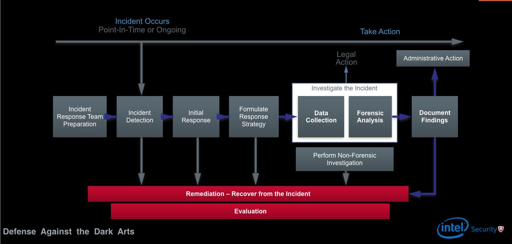
Screenshot from OSU Lecture by Christiaan Beek

The types of situations that require forensic analysis can be things like fraud and child exploitation, the latter of which is unfortunately what a lot of the work Mr. Beek had done in Holland was. It is later discussed how difficult this job can be when you need to recover images of terrible things like this. Luckily, they seem to have better methods for minimizing the amount of images and number of people that would have to look at that stuff. I found it very cool that they can use skin tone to determine the approximate age of someone in a picture in order to narrow down a search. I think I would be interested in building tools like that.

He says forensic computing is about getting data out of a system and representing it in a way that you can replicate and understand what happened on the system. It involves getting evidence, investigating, and reporting the results. It is important that when working as a forensic investigator that your only goal is to prove what happened and not that someone is or isn’t guilty. This can affect the investigation in negative ways. There are live, post mortem, and network forensics. Live forensics is very important. You lose a lot of data by pulling the plug on a machine. When possible, doing live forensics can be very useful, but if the situation is dangerous, then it is more important to pull the plug and go to a safe area. Post mortem is looking at data/memory after the plug has been pulled, and network is looking at network activity. Reporting the results is very difficult since the audience may not be aware of the technology involved. The report needs to be very tight because the investigator will get drilled by the judges. Mr. Beek has taught some classes to judges to help them know what to question and what to look for.

Very important things for investigators to keep in mind are to:
* Minimize data loss - You need to make tough choices on how to analyze the data without damaging it too much.
* Record everything you do (especially the time of things)
* Analyze ALL the data - usb, cell phones, gps in cars, etc. Sometimes you need to be creative with how to get data from a device.
* Report findings

There are many things that can be used as evidence as long as they can help prove or disprove a fact. Some examples are the operating system, peripherals, and the network. Mr. Beek recommends having a good knowledge of different operating systems for getting into forensics. He also recommends getting good at database forensics if you want a specialized field. There are very few skilled people that do this. It was interesting to hear that the investigators also do some interrogation of suspects and that they can be very useful. It is also important to note that you can’t use any passwords and accounts you find while investigating without permission.

It makes most sense to look at evidence that can disappear fast first. The order data should probably be looked at based on how quickly is disappears is shown below. You should start in the middle and go out.

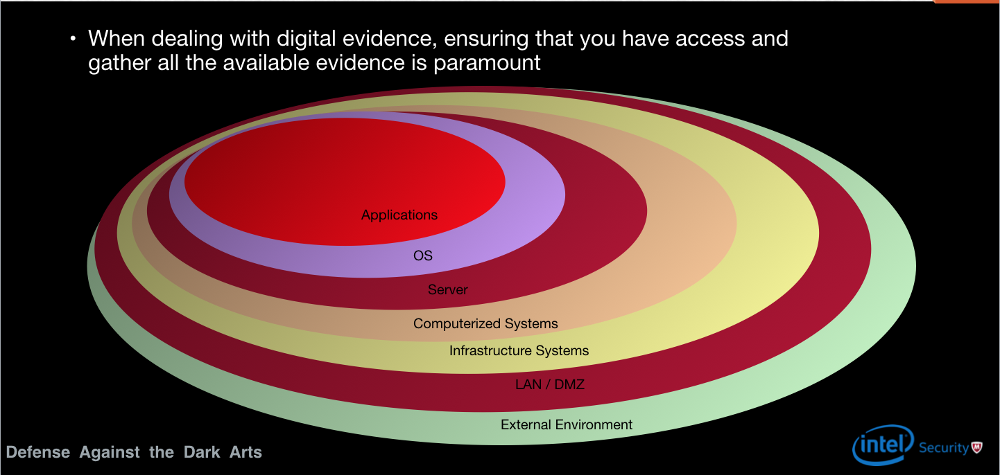
Screenshot from OSU Lecture by Christiaan Beek

Some challenges with evidence are the amount of data, time synching, skills (of investigators for different technologies), tools, and log format. Mr.Beek talked about the Siem tool which can normalize logs to make them easier to understand by one person. It is mentioned, and I really agree, that machine learning will help a lot in analyzing logs in the near future.

Triage means that you can prove a conclusion in several different ways. For example, find proof of something in the registry, log files, memory, database, and so on. There can be a lot of data, and with hard drives getting so large and time frames for investigations still being short, this can be a very intense profession. Also, SSD hard drives sound very difficult to investigate since the rules of older hard drives don’t apply.

You use a write blocker in order to read memory off of a hard disk so your computer wont send any damaging signal to the hard disk. This tool is much cheaper and easier to use than older techniques which required bringing lots of tools with them to an investigation.

Locard’s Exchange Principle: when two objects are in contact with each other, it will leave evidence. For example, you leave DNA everywhere you touch. This applies to computers in that everything you do a computer you leave evidence, so you need to document everything you do so that there is a record of the evidence you are leaving behind while investigating. It is even more important because there isn’t way to reverse your actions.

Mr.Beek stressed the Order of Volatility (RFC 3227) which is the order in which you gather evidence. This priority is based on how quickly the evidence could disappear or become corrupted. One interesting thing was that memory could be frozen in order to stay preserved. There is a huge amount of information that you can get from a memory dump (RAM). Mr. Beek views the memory dump as one of if not the most important piece to analyzing behavior. Volatility is a useful tool for analyzing memory dumps and you can use it with Yara which makes signatures for malicious behavior. There are many plugins that are small programs that can be run with Volatility.

The windows registry has a lot of information such as data about the user and when usb sticks and other peripherals are connected. Reg-Ripper is a useful tool for analyzing the registry as well as Regedit. Autorun is a popular spot for malware since it can survive reboot that way.

$MFT (Master File Table) shows times about operations on files so this is very useful for building a timeline. Volatility and Reg-Ripper also can help make timelines so these can be used for Triage of the timeline.

Data carving is the term that means data recovery for files that were deleted. When you delete a file, the data representing it isn’t actually removed from memory, but the address of where that data is gets deleted. So, you can search for the pattern of certain types of files in order to recover them from memory. Mr. Beek talks about how one of his teams bought a bunch of old phones and found a ton of data on them which is really creepy.

### Labs

This week had four labs meant to introduce us to new tools for forensic analysis.

The first lab used FTK Imager to create a memory dump. This is a free tool so I could play with it on my own sometime. We learned to always store the memory dump on external media and not the suspects machine since it will contaminate a lot of evidence. We broke this rule because we were on a VM. FTK Imager runs in RAM so it can tamper with the memory, but it is a risk that needs to be taken so that we can make a memory dump. Mr. Beek uses a Command Line tool called FastDump when he works on his own since it tampers with RAM less. We explored the capabilities of the tool like looking at the memory of the VM, the master file table, and how you can obatin protected files that you normally could not on normal Windows. An important takeaway was to never install forensic tools on a suspects machine as this greatly affects the evidence. That is why we need the memory dump, so we can analyze the memory on a different machine that has these tools.

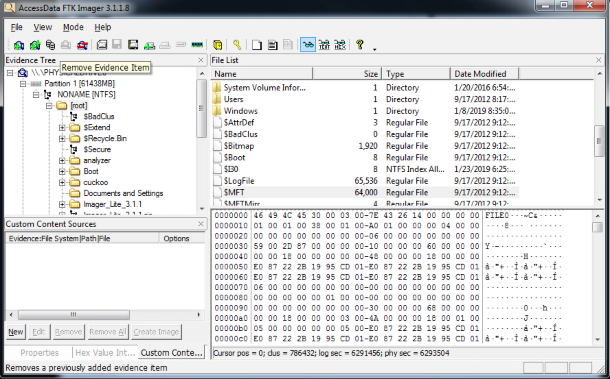

In the second lab we used Volatility which is a tool for analyzing memory dumps. I really enjoyed this one as it seemed super powerful and had many different plugins to extend its functionality. You run the program from the Command Prompt and give it the plugin you want to use as an argument. Some of the plugins we explored are:

* imageinfo - general information about the memory dump, such as the time it was taken and the os profile.
* psscan - lists the processes that were running on the machine including process and parent process ids.
* dlllist - lists the dlls that were loaded into a specified process.
* netscan - shows network activity.
* deskscan - information about things running on the desktop.
* getsids - shows the user rights of malware.

We saw some of the processes from our lab last week such as evil.exe and svchest.exe. This was probably my favorite lab since the tool seemed very interesting.

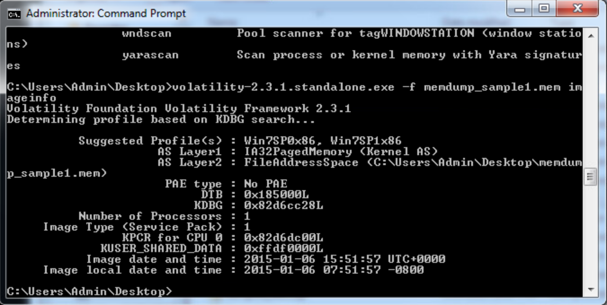

In the third lab we ran two more plugins for Volatility. These were timeliner and mftparser. Timeliner shows an overview of all the processes and helps with building a timeline of events. Mftparser gets the master file table information such as filenames and registry settings. These would both be very useful in a real investigation.

timeliner
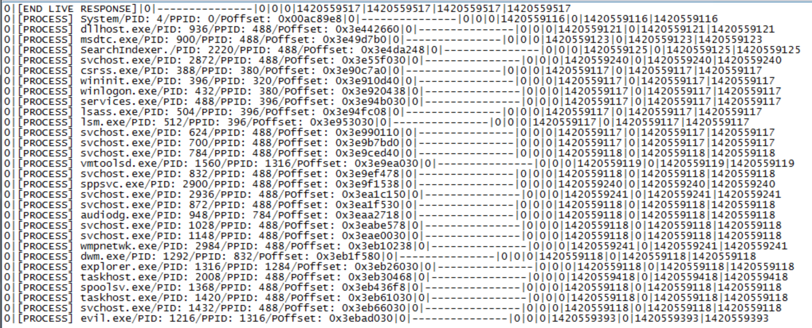

mftparser
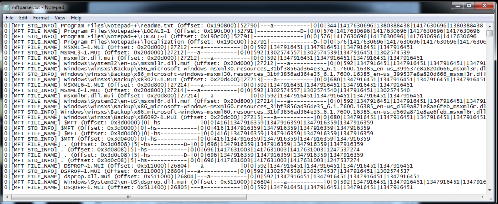

The fourth lab was very cool, if not potentially creepy, and involved recovering deleted files. We used a tool called PhotoRec whcih can recover different file types by looking through memory and finding a common pattern that all those types of files have. It is only sophisticated enough to find full files, but there are other tools to find partial information. Mr. Beek prefers Sleuth Kit to recover files because it it much lower level but doesn’t have a nice GUI. We used osfmount to mount the image of a file system, and used PhotoRec to recover 14 files from it. This seems like a tool that would be fun to experiment with on my own.

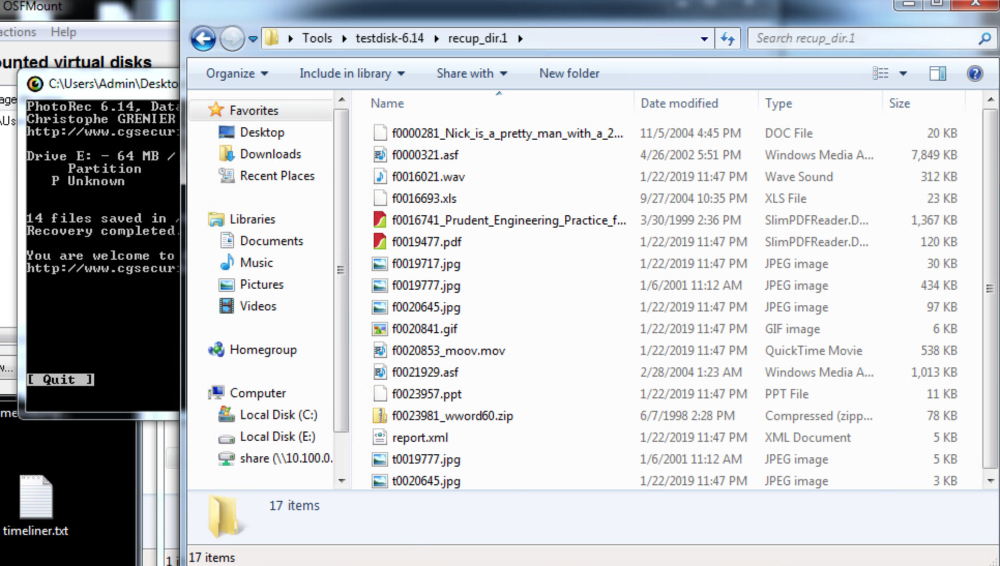

### Challenge

In addition to the labs, there was also a challenge this week. We were given an image of a usb stick from a North Korean hacker, and had to find out who was being targeted and what did it do.

I started by using osfmount to mount the image. It contained several files, some with Korean names and one with English. One of our hints was to translate these names, but I had trouble doing that from the VM.

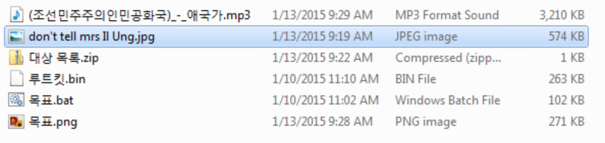

I also wanted to know if there were any deleted files on the image, so I ran the image through PhotoRec which recovered 8 files.

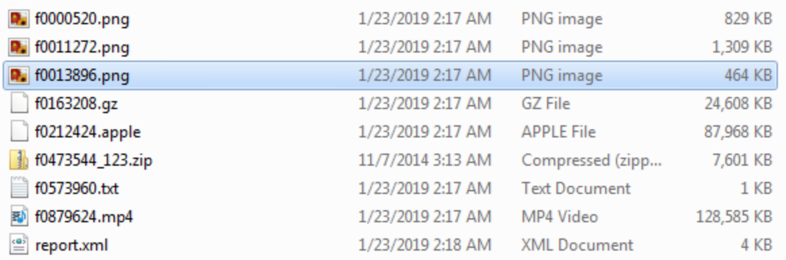

I then started exploring the files. Using hints from Mr. Beek, I knew that the password to unzip the zip file in the mounted image was in the jpg with an English name. I opened the jpg in file insight, and found a password using the Strings plugin.

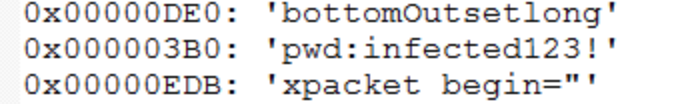

Using the password to unzip the file gives you a csv file with a list of targets inside.

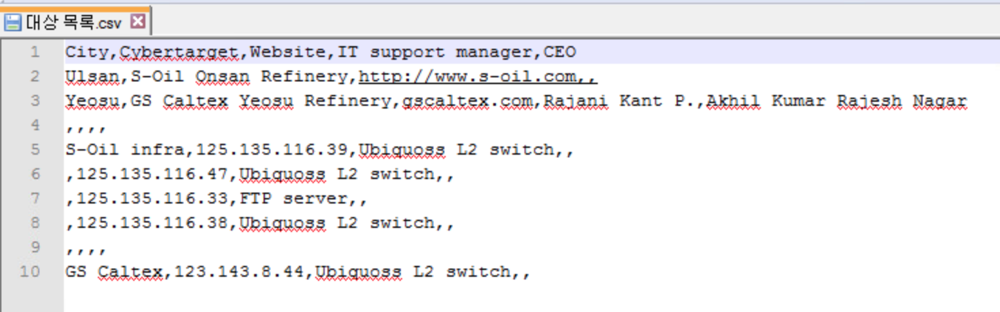

Among the recovered data files, there is a creepy image that says hacked by the #GOP. It has a like of urls that all end with the file SPEData.zip.

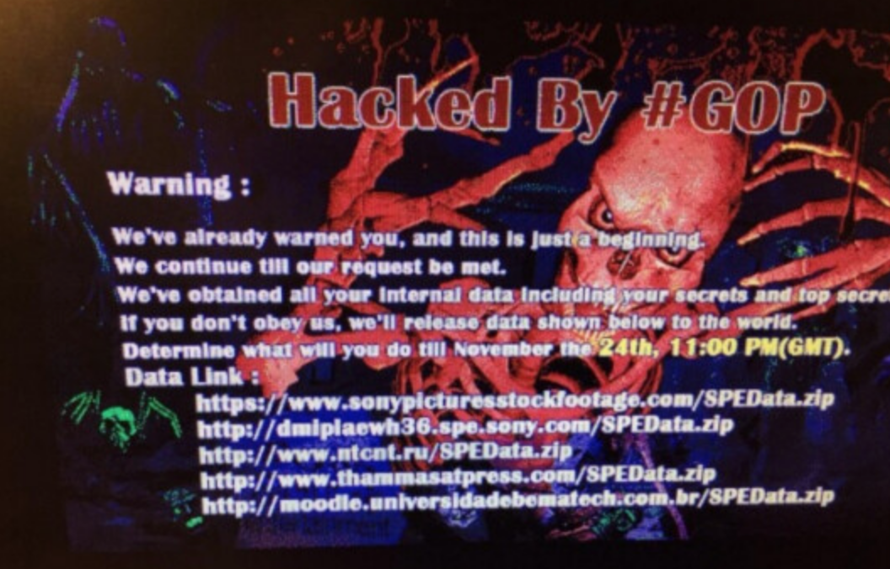

More hints from Mr. Beek unveiled that the .bin file was the malware and that it contains usernames and passwords that are encrypted. I ended up finding them by using an XOR text search for SPE. Sure enough, I had found the usernames and passwords.

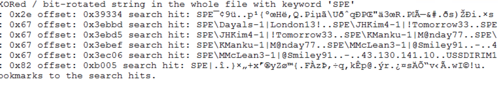

I had found the list of targets and a list of user names and passwords. I truly relied on the hints to get through this exercise since I’m very new to forensics. I followed up with trying to find out what the malware in the .bin file was doing. I moved the files to my desktop and renamed the .bin file to challenge.exe. I brought up the process monitor, fake net, and anitspy to see if I could catch anything interesting. After executing, the process monitor showed that the malware did a lot of things in the registry and with driver files. I also noticed that a new executable was created in the same directory as the malware. I then noticed that fakenet had a lot of traffic.

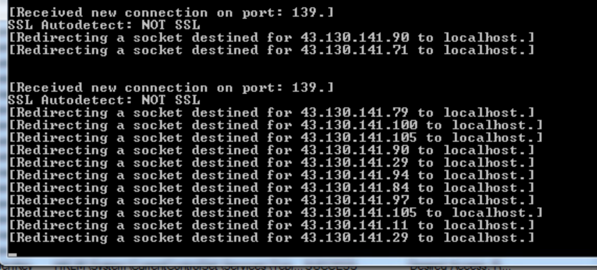

I had seen some files with lists of IP addresses in the recovered data, so I suspect that this malware is trying to send data out from the computer and is using the registry to survive reboot.

### Final Thoughts

The material this week was very interesting, and if nothing else, this class is doing a good job of making me paranoid. I still don't think I would enjoy a career in this field, but some of the tools utilizing machine learning to do analysis are of interest to me. Building something like a program that can guess age from skin tone seems really cool. I did have some fun doing the labs this week though, ecspecially playing with Volatility from the Command Prompt.

Works Cited: All Information Used in Preparing this Post came from the Oregon State Lectures from Christiaan Beek.

## Week 1 (1/15/19)

The Lecturer this week was Christiaan Beek. He works for Intel/McAfee and has done lots of work for the government as well. He is very knowledgeable on the subject of malware and is very enjoyable to listen too as he shares anecdotes about some high profile cases of attacks as well as some I hadn’t heard of.

Malware (Malicious Software) is created for many different reasons depending on the attackers motivations. It can be politically motivated such as attacks by governments on each other, financially like a criminal stealing credit card numbers or businesses bankrupting a competitor, or possibly made by someone who wants to just destroy things. Whatever the motivation, companies and people need to protect themselves, and one way is with anti-virus (AV) software which McAfee makes.

Mr. Beek has done a lot of research on samples of malware. He talks about using different tools to understand the threat and build a solution. He mentions that his company can get 200k-300k  malware samples to test daily which I found very interesting. Luckily, malware research seems to be very collaborative across companies and governments because that is an immense number of threats. It is mentioned that there is a demand for malware research skills. I am interested in the subject matter of this course since it is very foreign to me, and although I find it interesting to learn about so far, I don’t think it is something I would like to pursue as a career. It does seem useful to be aware of however.

There are different types of malware and I didn’t know the details of their differences before:

* Viruses:
  * Parasitic - depends on another file
  * Polymorphic - dynamically changes itself (very difficult to analyze/kill)
  * Worm - spreads quickly
* Trojans - sits on a host computer and sends back stolen information
* Potentially Unwanted Program - stuff that ends up on your computer you might not want like adware

The polymorphic viruses sounded particularly interesting and difficult to deal with. They can change where the malicious code is in a file and make themselves difficult to detect.

Computers get infected in a variety of ways, but the primary method is by the user. At some point it is mentioned that for an email with a malicious link, it typically only needs to be sent to 8-10 people to get one click. Things like USBs are another way, but I found it very interesting that PDF and Microsoft Office files were a particularly popular way to deliver malware. I never really thought about it, but the lecturer really stressed the vulnerabilities of these file types.

Some More New Malware Definitions I Learned:
* White - clean sample
* Black - dirty sample (infected)
* Gray - not really sure if it is clean or dirty
* Sample - potentially malicious program being researched
* Goat - sacrificial computer that malware is run on to see what it does. some malware can recognize it is running on a virtual machine and change its behavior so this is useful. (this is also my favorite new word/definition)
* Honey-Pot - server waiting to catch malware so it can be studied.
* Hash - unique string calculated from a file and its contents. (only one piece of malware has been able to duplicate a hash)
* Replication - replicate what the malware is doing in order to create counter measures.

I found exploitation kits interesting. It seems like a hacker could gather information about a computer and then use exploits from a kit specifically tailored for that type of operating system and version, etc. I also thought ransomware was very interesting. This is software that can hold data or access to a system for ransom. It was really spooky when it was later talked about how this could be used on a car or medical device. Ransomware seems like it will be a huge problem with the internet of things.

I learned that Advanced Persistent Threat (APT) represents some aspects of attackers using malware. Advanced attackers are clearly professional as demonstated by their code and ingenuity. Persistent attackers have clear goals that they will consistently work to reach no matter how long it takes. Threat attackers are backed, motivated, and have a plan. These aspects can be combined to make more dangerous attackers.

In the lectures and in the lab, I was introduced to some ways to analyze malware. There are two main methods:

Dynamic:
This is where a malicious sample is run on a Goat or virtual machine (VM) and different tools are used to analyze what it is doing in real time. Here are the new tools I have been getting familiar with this week while analyzing a piece of malware on a VM:
* Flypaper - This program prevents a program exiting. One way this might be useful is if a program deletes evidence of its evildoing when it exits.
* FakeNet - This program creates a fake network for the malware to connect to so you can see the requests being made. I found this very helpful since it gives you the domain name and HTTP request.
* Process Monitor - This shows what a process is doing which could include creating new processes to check for. I used this to see that a program was making a bunch of new driver files, running command line commands, and making other directories and executables.
* Process Explorer - This shows parent and child running processes. I was able to see a malicious program had two child processes which were running on windows terminals.
* Antispy - This has a lot of different kinds of information on things like registries, processes, and network activity. I used it to see new run keys in the registry.

Static:
This is where a file’s contents are analyzed. Sometimes malicious code is embedded in a file and can be found by looking through the contents. I used a new tool called FileInsight to look at the contents of an executable that was scheduling tasks. It allowed me to see the code and try to understand what it is doing that way.

Overall this week, I found the lectures very enjoyable, but the hands-on work was a mixed bag. Listening to a Industry Professional with varied experience share his insights was a pleasure. The lab was a struggle because the VM would often freeze and I would have to revert to my last snapshot (version of the VM at a time before the virus was run) and restart the steps in the lab. I suspected that it could be a cpu issue since I had better results running less tools at a time; however, I saw a post on piazza that suggested that running the Process Monitor and Flypaper at the same time caused a problem when you stop capturing events. The actual work of trying to understand what a piece a malware was doing was fun, although I don’t think I’m very good at it yet.

Works Cited: All Information Used in Preparing this Post came from the Oregon State Lectures from Christiaan Beek.
