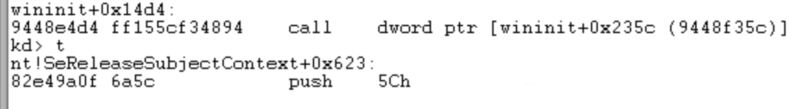

# Defense Against the Dark Arts

## Student: Zachary Anderson (andezach)

## Week 9-10 (3/15/19)

This session we had lectures on Mobile Security from Fernando Ruiz who is a McAfee researcher from Chile. He had two colleagues from the same research team who seemed to be present primarily for support. The first was Alex Hinchliffe who has been at McAfee for 15 years in PC Security and now Mobile Security. The other was Carlos Castillo.

We started with a little history on the mobile space. The first mobile phone you could buy released in 1984. IT was $4,000 and allowed you to talk for 30 minutes. It's pretty remarkable how much that has changed up to today.

Up until 2007 there were about 4 companies in the market for mobile operating systems. These included Symbian and Blackberry. Then Apple entered the scene with iOS on the iPhone and started the smartphone revolution. Over the years iOS has stayed fairly steady in their market share while Andriod has grown significantly. It surpassed Apple in 2012.

Apple iOS is proprietary and only on Apple devices. It fully integrates with Apple software/services.
Microsoft Windows phone is also proprietary and fully integrates with Microsoft software/services.
Google Android was aquired by Google in 2007 and is free and open source...for the most part. It is customized by diferent carriers which can lead to buggy versions.
Ubuntu Touch and Firefox OS are a few mobile operating systems I didn't know about that looked interesting.

## Week 8 (3/5/19)

### Lecture

This week we had lectures on Messaging Security from Eric Peterson. Mr. Peterson is a Research Manager at Intel Security / McAfee. Interestingly, he has a background in aviation and went to school to be a pilot. He ended up doing email security at small startup he said he still works for. The company protects about 30 million inboxes. His lectures involved a lot of participation and conversion which I enjoyed even though I couldn't directly take part.

We started by talking about phishing. Phishing can be described as taking information for malicious purposes. A layered defense is used in order to combat this, and the last layer of that is the user; therefore, they need to be educated. We took a phishing quiz which is meant to test how susceptible people are to phishing attacks. I noticed there seems to be some ambiguity around what is legitimate and what is phishing. Also, determining whether or not something is phishing without any context was sometimes challenging. A number of the samples in the test didn't seem legitimate, but they didn't seem to be seeking information either, so I don't think they were phishing. For example, the first sample was a linkedIn coupon email which didn't seem legitimate, but also didn't seem to be seeking any information. I guess it could've led to a malicious site to get info on the user.

We saw that a common phishing method is to send an email to ask someone to verify an email or username. There was also an interesting observation that something like a wells fargo banking email could be legit, but since it looks so bad and has click bait links, it probably makes it really easy for phishing attacks to look similar. Mr. Peterson said that HR workers are apparently more susceptible to phishing attacks and are also the worst at identifying attacks. This stresses the need for education on the subject for HR employees.

New Terms:
* Spam/Ham - Spam is illegitimate mail and Ham is legitimate.
* Spamtrap/Honeypot - This is an unprotected computer used to collect spam emails. It has no reason for emails to be sent to it (it is brand new or retired) so any messages it gets can be then classified as spam.
* Botnet - A series of compromised machines used together for malicious purposes.
* Snowshoe Spam - Real snowshoes distribute someones weight. Snowshoe Spam spreads the load of a spam footprint across many IP addresses in order to get around reputation filters. These are the hardest to detect.
* Phishing vs Spearphishing - To the masses vs To specific targets like companies or people.
* RBL - Realtime Blackhole List, blocks spam senders that are on the list.
* Heuristics - Rules for filtering spam. This can be string matches, regex, and meta rules which look at many parts of the email together and are more effective and general.
* Bayesian (Statistical) - Get tokens from spam and ham and calculate their prevalence to rationalize blocking or not blocking messages containing them. This is similar to my approach for blocking URLs with a certain file extension from last week.

The Spamming Classics:
* 419 Phishing - This is advanced fee scamming like the Nigerian prince scam. The 419 is a reference to a law that makes this illegal.
* Canadian Pharmacy - This is a pharmacy link with a legitimate looking site. It gets around heuristics by embedding text within html scan tags.
* Pump n Dump - This is artificially inflating stock by sending spam to get people to buy it.

Spam is fought with reputation-driven (ip, message, etc) and content-driven (heuristics) approaches.

Tools:
* DIG - DNS lookup utility.
* WHOIS - Domain name lookup.
* Postgres - Advanced open source sql database.
* Regex Coach - You put in regular expressions and a target string. The program then highlights the parts of the target string that match the regex. I have used something similar to this when building regular expressions at work. I haven't had to do anything too complex which is good since they seem to get really complex. It is definitely a good skill to improve though.

There are billions of emails that need to be scanned for spam, so there are different techniques for studying and filtering them. Such as:
* Parsing - Reads and extracts the keys parts of metadata for information.
* Grouping - Groups data by things like window of time, subject, url, etc.
* Aggregation - Aggregate values over time for something like distinct subject lines as maybe some are known to be spam.
* Identification of Outliers - Try to understand situations where something that is usually called spam might not be sometimes.

Since there are so many spam samples, there is a lot of automation in identification and filtering. However, as we have seen in previous weeks, humans can typically come up with better rules but are slower. Accuracy and time both need to be considered then when exploring options for filtering spam. This sounds tedious and like a job I wouldn't enjoy, but designing the automated algorithms might be interesting.

We looked a little bit at the SMTP protocol for a spam and ham message. One thing that stood out was how easy it is for a sender to spoof who the email is from. This seems like something that could be mended. It was also interesting to see an email header which shows the path that a message took. You read them from the bottom up, and I think the formatting makes it a little tricky to read.

We did a spam rule exercise where we listed observations about a spam and ham message. The observations were things like subject lines, origins, punctuation, links, images, and much more. Mr. Peterson then showed us how to get a picture of these observations by plotting them on intersecting lines and then connecting the points to make a shape. We can then make the same plot for new emails and check if they fit the shape of ham or spam. His example only used a few observations, but in the real world I could see these getting extremely complex.

### Labs

The main lab this week involved identifying spam messages with our own rules. The challenge was to be both accurate and get the most matches with a single database update. I didn't leave enough time to refresh my SQL skills and complete everything with this lab. I ended up messing around with the postgres CLI and trying to understand how I could get enough information to make rules. Students in the lecture were able to identify over 70,000 of the 100,000 samples as spam, many in one update query. It wasn't checked for false positives though, so I'm interested in the actual numbers. Mr. Peterson said that students at Cal Poly were able to build rules that were 99.85% accurate. If I have time, I'll go back and see what else I can do.


### Conclusion

I found the material this week to be very easy to follow. It wasn't as interesting to me as other weeks, but I felt the lecturer was good and very knowledgeable. I think the idea of classifying messages as spam or ham doesn't seem as exciting as some of the other things we have learned, but it is definitely important, as is education about it.

Works Cited: All Information Used in Preparing this Post came from the Oregon State Lectures from Eric Peterson.

## Week 7 (2/26/19)

### Lecture

This week our lecturer was Cedric Cochin from Intel Security / McAfee Labs. He works in computer and network security, and this web presented on Web Security. He was a white hat hacker for a while, but he wrote some software to test security and eventually ended up at McAfee. I really enjoyed he teaching style as he had lots of examples when discussing different exploits and tools. I find this really helpful for understanding.

Before we started, we were cautioned that doing the things we would learn about today could get us jail time. My first thought, and one of the students thankfully asked the question, was what about when you’re exploiting vulnerabilities for prize money or just to inform an organization of their security holes. Mr. Cochin said it is a grey area and to be careful. The main point was to immediately disclose what you did and found, and you need to show that you did not get any personal benefit. Personally, I wouldn’t mess with anything unless it was clear that finding vulnerabilities would result in prize money.

On the web, attacks get old because the browsers learn to block them quickly. It is a war that moves very fast. Mr. Cochin said that in lab, we will use the firefox browser since chrome blocks the exploit we want to do. I wonder if firefox has caught up since the lectures are from several years ago. It makes sense, but I find it interesting how much work needs to go into getting the correct version of all the software on your machine in order to practice certain exploits and defenses.

The types of attacks involving the web have evolved over the years. Early on there was a lot attacks where an attacker would copy a website and send a link through email or some other means. Victims would visit the site and give away personal information thinking they were at a legitimate site. There were also attacks like an archive bomb. Moving on, attackers started doing browser exploits like the stack overflow and use after free exploits from a couple weeks ago. They also started using sql injection. There came  point where there were so many different browsers being used that the best way to attack the most people was through phasing and 3rd party plug ins most people used. Theses are things like adobe reader and flash. Finally, they started to stay in memory and work from there, rather than in the browser, since modern browsers have a lot of security. Web security is so important because 95% of malware is delivered by the web / internet.

When attacking a web browser, the main points of attack are the network / protocol, the DOM, and the UI. In the past, javascript was just in the DOM, but in modern web browsers you can find it in every layer. This has led to all attacks having some javascript involved. Like we have heard most weeks, malware is aimed for Windows machines.

User Level Attacks:

* Social Engineering - Get an individual to do something willingly for your malicious intent. Users are lazy clickaholics, so their actions can be directed towards malicious content such as executables, browser exploits, and malicious forms.
* Phishing - Make a website that looks and acts just like the user wants…except it is malicious.
* SEO (Search Engine Optimization) Poisoning - Try to get high in search result rankings so more users click on a malicious link. Google text search has gotten very good at preventing this, although their image search is still vulnerable. Other search engines evidently have some ground to make up. Interestingly, developers are a common target. If an attacker gets their response to a common issue on a site like stack overflow to be ranked high, they can get many developers to maybe use a malicious library or something.
* Fake Updates and Fake AV - Get user to download bad programs thinking they’re good programs like anti virus software.
* WYSIWYG (What You See Is What You Get) - Use funky urls that look similar to real ones in order to get users to visit them.
* Social Media Attacks - Use social media and online groups to get people to reveal personal or secret information.
* Malvertising - Seed specific ads for a target group of people through an advertising company, and the ad can redirect to a malicious site.
* Waterhole Attacks - Go where a target group of people go, such as forums, and hack and deliver a payload to redirect users to something malicious.

With so many attacks it is hard to stay safe. There are several solutions being used.

* URL Reputation - Score urls on their reputation, if the score is low it could be malicious.
* URL / Search result annotations - Search engines can annotate potentially malicious sites.
* PCI - Make sure credit card information is safe when using online.
* Signed - Signed and certified destinations and downloads.
* Current AV - Up to date anti virus.
* Safe URL Shorteners - Use a url from a url shortener. Also look at the bottom of the browser to see where a url is actually taking you.
* Content Provider and End User Education - This is what is says. I don’t have a lot of faith in the average end user to be that safe online until they get burned once or twice.

An interesting point made by Mr. Cochin was that APT () Advanced Persistent Threat) is a bit of a buzz word in the industry. All it really means is that something broke in and stayed somewhere for an extended period of time. We learned this vocabulary in the first week of classes. The topic of credit card safety also brought up the cultural difference in the US and most of the world where we allow a waiter to take our card out of sight, but most of the world will have the waiter bring the card reader to the table. I lived in China for a couple years and this was definitely the case. It makes so much more sense to me that the card reader should be brought to the table, but it never really seemed weird until leaving the country.

Besides the users, the attack surface of the web also includes the browser and 3rd party plug ins. Malware can even get to the browser from a local desktop. There was a side conversation about how two factor authentication helps web security, but as always there is a work around where the attacker can hack into the mobile phone getting a security pin as well as the browser.

It was interesting to learn that modern browsers have layers of sandboxing to prevent attackers from leaving browsers or tabs, but there still needs to be more security since there are always ways to escape.

Browser Exploits:

* Content / Script Obfuscation - Javascript is a big and ugly language with many ways to write programs. This means you can write programs that are very hard to understand. You can even encode strings and fetch code from different parts of the browser, like the DOM, to build a malicious script. An interesting side note is that many sites use the same obfuscation tools to compact their own javascript code. This is because shorter code can be delivered faster and thus reach more users.
* MITM (Man in the Middle) - We talked a lot about this previously. Attackers can intercept and modify network traffic since many things are still unencrypted. They can steal information or insert things to redirect the request. Even scarier, it can also work on home networks since many network router names are easy to guess. Attackers can guess the name, redirect the user, steal passwords, and even re-image the router so they can add their own software. It is safer for malware to hide in memory than in the browser.
* DNS Spoofing - We spoke about this previously as well. Something new was that something like a USB can redirect network requests to a different DNS server to lead users to malicious sites.
* Clickjacking / UI Redressing - Overlay things in the browser so the user will click on something that looks correct but actually does something else. I have seen sites with video players that do this. They will have a button that says close window, but clicking it will bring you to another site.
* SQL Injection - Put SQL code directly into the database for when the server doesn’t correctly filter inputs for code. There are many different types of SQL with different vulnerabilities. Mr. Cochin wrote a cool tool to determine what kind of SQL a site is using and what it was vulnerable to. I enjoyed learning about these exploits since I had an understanding of what it was before, but did’t realize the great variance in attacks.
* Client Site Scripting (XSS) - Inject client side script into user’s browser.
* Client Site Request Forgery (xsrf) - Trick user’s browser into sending requests to a target on your behalf.

Mr. Cochin spoke briefly about a trick used for honey nets in relation to SQL injection attacks. You can throw an attacker off with error messages that will make them think you are something you’re not. For example, make them think you are using a different programming language. This is mainly for honey nets, because he said in the real world it would be best to not send an error message. At work, we write some apis, and we return custom error messages so we don’t reveal too much information. We also don’t explode the underlying data types, which I did’t understand the purpose of before, but it makes more sense now.

Web Malware Toolbox:

* Alexa - Shows how prevalent a given domain name is. Very prevalent and not prevalent are typically not suspected as being malicious. Malicious domains typically rise in prevalence very quickly.
* archive.org - Website that allows you to go back in time and see a web page at a point it was hacked or doing something bad.
* ipvoid - Check IP against a blacklist which is formed from other times an IP was used. Attackers often reuse old IPs. Typically, normal sites has many IP addresses, and bad ones usually have none and no mail server.
* checkshorturl - Find where a short url actually goes.
* Site Dossier - Show the bigger picture around a URL/domain.
* Webutation - Web reputation score.
* Web Inspector - Inspects the URL results.
* Virus Total (URL Total) - Scan the web, has information about URL files, and aggregates results from different AV softwares.
* Linux jwhois - Info about the person/entity who made a site. Often the creator will have their name(s) tied to it, and they may have a bad reputation.
*  Linux Dig - This is a DNS lookup utility.
* IOC (Indicators of Compromise) - Connects the dots from all the clues and gives the full picture. Looks very interesting and helpful.

Web Malware Research Tools:

There are many proxies available which allow you to fuzz content.

* Phantomjs - Web Kit (these replay the browser so you can automate things like clicking and going around) to interact with site in automatic fashion. This is very helpful since there are 100x more urls than malware samples to examine.
* jsunpack - Makes sense of what is happening and understand the scripts.
* Burp Suite - Can be used like Tamper Data. It spiders across the web which is like a type of web crawler.
* Webscarab - Similar to Burp Suite.
* Firebug - Like Tamper Data.

URL Classification:

* Manual - Person goes through and records everything they do (may get one shot when calling a URL). This is typically reserved for top threats since it is time consuming.
* Static - Just scans the page without rendering it.
* Low Interaction - Typically web kits, They execute quickly.
* High Interaction - This is like a web kit, but it slows down and acts more like a user since sometimes malware will sleep to trick a web kit.
* Host/Lexical URL Classification - Use rules to classify URL based on the way it is. For example, some things with good URLs are they have a prefix like ‘www’, are short since thats more expensive, and end in something common like .com.
* Graph Based Classification - Traverse a graph to determine who is guilty by association. I have used Neo4j before which is an interesting way to organize data.
* The Expert System - This classifies URLs without looking at their content. URLs are continually reprocessed until a conclusion is reached since each iteration can reveal new information.

### Labs

We had two labs this week. The first one used a new tool called Web Goat. Web Goat is an insecure web application which people can use to practice exploiting vulnerabilities. It is both useful and fun to work with.


The other lab involved expanding a python script to classify URLs as malicious or not. I managed to build a set of rules using a training data set in order to classify URLs in an unknown data set. We were told that about 50% of the URLs were malicious. I got 1013 good and 1011 malicious. I'm not sure how accurate it was, but it seems promising. I found it pretty straightforward to find the optimum value to compare against for individual measurements or properties, but it was a little finicky combining them. I ended up finding that being pretty aggressive led to better results with the training data set, so thats what I went with.

Sample Results From the URL Classification:


### Conclusion

I found the material this week much easier to understand and interesting. The lecturer was great, and the material was more relevant to my work. Even though we don't get experience with all of the tools that we talk about in lecture, I enjoy learning about their specific use cases.

Works Cited: All Information Used in Preparing this Post came from the Oregon State Lectures from Cedric Cochin.

## Week 6 (2/19/19)

### Lecture

This week’s lectures covered Network Security. They were presented by Geoffrey Cooper and Ram Venugopalan who are both from Intel Security. They didn’t go into much detail about their respective backgrounds and work, but they were both very knowledgeable on the topic and led interesting lectures.

We need network security since threats come in from the network and can cause many different issues such as stealing sensitive information and overloading servers. We started with an exercise on the Robustness Principle from Jonathan Postel. The green parts I agree with, the red I disagree, and the final black
paragraph I'm undecided on.


I think when designing new software, it should be able to fail gracefully. The only way to get close to that is by preparing for every possible combination of errors. Assuming that someone with bad intentions will try to break your code is a good exercise to think of new possibilities.

I disagree that the most serious problems on the internet were just caused by low-probability errors. I think significant damage has been and could be done by human malice. I assume this was written before a number of high profile hacking cases that were very dangerous or damaging such as the cases at sony or stuxnet.

I think the ability for software to adapt to change is very important. With technological innovation occurring so quickly, it would be impossible to keep up if the infrastructure to support it all had to be updated for every change. Being adaptability lets everything evolve around it.

I was torn on the last point because while you don't want to risk causing a failure on a host you are sending to, it isn't fair that you have to limit your capabilities because other hosts are inadequate. So in principle it makes sense since it makes things more likely to work, but it seems like it encourages complacency that limits certain advances.

There are several different strategies to secure a network. Some I was familiar with before, but there were some new ones as well.

Positive Policy: This is essentially whitelisting things that you have decided to allow into your network. This strategy gives an advantage to the defender because it forces the attacker to guess what whitelisting polices are implemented. It also limits the attack surface which means that there are less vulnerabilities for the attacker to exploit, and other protections that are being used can be more effective since they have less to worry about. Furthermore, the amount of things being whitelisted is much smaller and easier to predict than the things that could be blacklisted. One disadvantage is that it can detect that something is a threat but not what that threat is.

Firewalls/Security Zones: There can be defined zones in a network, and the traffic that is allowed to go between zones can be handled by a firewall. Firewalls will filter network traffic based on a chosen policy. We did a small exercise to think of what policy might be implemented between a theoretical network with security zones. We also saw that there are different types of firewalls. Two of these are called Web Gateway and Email Gateway. A Web Gateway is more specific than a firewall. It gets a better view of the data and can block specific parts of a website whereas a firewall would block the whole thing. An Email Gateway can filter spam and malware that might come through email.

Below are the results of an exercise to define the firewall rules between different security zones. I
tried filling it out to the best of my knowledge, but I feel I probably made the network really insecure.


A common theme in this class has been a layered defense. We want to have a layered approach from the network in since there are many ways to infect a machine. Network Security works best when it is layered itself such as having a firewall filter data before hitting an intrusion protection system.

A very interesting layer of Network Security I had never heard about was the SIEM. This gets logs from all the different security devices. Using these, it can give an awareness of what is likely to be attacked and can alert or defend.

Intrusion Protection: These systems differ from firewalls in that they blacklist instead of whitelist things. They are good at detecting well understood threats and work quickly; however, there is a risk of having false positives.  

Honeynets: This are similar to honeypots except their goal is more to distract attackers rather than capture malware. They are phony networks set up to take up an attacker’s time instead of going after the real systems. An attacker can even capture files and info from them. Its an interesting idea, but I’m interested in how effective they are.

Quarantine: When a threat is detected, it can be put into a quarantine where it will be all alone and unable to do actual harm. This gives defenders the ability to analyze the behavior of the threat.

Reputation: This involves giving a score of trustability to control access and decide how to handle requests from certain IPs / Mac addresses and locations. Big data is used to get information such as being able to tell 50% of attacks come from a particular group of IPs. I had heard the term big data before, but its meaning in this context was new to me.

There are many different products that can be used and layered for Network Security. As an administrator, the goal is to understand how to use the products by checking what they do and fitting them to their needs.

Deep Stateful Inspection: This is a new strategy I learned which goes through everything something coming in would do.

Next Gen Firewall: Mr. Cooper joked the name is more for selling new products, but with the newer firewall the deeper you go into a packet ,the more detailed your policy can be. This gives the ability to block parts of things which sounds like what the Web Gateway is able to do.

Man in the middle refers to intercepting messages and doing something wth them between the source and destination. MITM can be used for both good and bad. A good man in the middle might protect the destination from receiving something malicious, but a bad one might change your request to your bank to send money from your account the the attacker’s.

HMAC: Detects MITM. It is a one way function that takes a large number of bits and converts to small number. You can’t invert it, so it makes it harder to be corrupted since the attacker would need to crack the HMAC.

Public Key Cryptography: Another way to protect against corrupted packets from MITM attacks. We learned about this in our networking class. There is a private key on the host computer to unlock messages, and a public key on other computers to lock messages being sent. This reduces the need for N^2 keys to sent secure messages to many people to something more manageable.

One interesting theme that keeps coming up in this course is even when you think you’re safe, there is probably a workaround. We discussed the use of trusted certificates between hosts being a secure way to send messages, but even these certificates could be altered so it’s hard to know what to trust.

Reconnaissance: This is gathering information about a network. There are two types: active and passive. Active is for an attack looking to exploit vulnerabilities on a network and needs information about the system. Passive is an attacker observing and learning about people or organizations on a network.

An active attacker will scan the network for vulnerabilities. It will try to vary how it is getting information in order to avoid detection. A fast scan is easier to detect. This makes sense since the network would see the same source doing different suspicious things on the network. The SIEM logs help find slow scans, but even with those logs, slow scans are hard to detect.

Spoofing: This is where an attacker is able to put spoofed values into messages in order to bypass security or cause general havoc. My favorite example, which I had not heard of before, was the LAN DOS attack. This is where an attacker spoofs the source address to be the address of the destination they are sending the message to. It then causes the designation machine to make a loop of requests back to itself which kills the stack. Spoofing defenses consist of things like checking that the port makes sense and asking: would a request you made look like this?

Denial of Service: These attacks consist of taking up a system’s resources to the point where it slows it down or causes it to crash. This can be targeted at specific websites, governments, or businesses for different purposes. The slashdot version of this is an accidental denial of service. It’s basically like when someone uses reddit to share a website they made and it gets really popular. There is an unexpected amount of traffic to the server asking for the site and it crashes. They like to call it the reddit kiss or squeeze of death. Another type of this attack that I didn’t know about previously is DNS amplification attacks. This is where the dos sends out a ton of data to a spoofed address causing it to crash. There is apparently an enormous amount of data that a DNS server can send.

We learned there is a site called Shodan that has a collection of all the vulnerable routers in the world. This is yet another thing that seems to reoccur every week. There are so many resources for an attack to use that are easy to find on the internet. I’m curious about what is on some of them, and I’m sure visiting them will put me on a list…although the professor joked taking this class probably already did that.

Bugs and Backdoors: Bugs are unintentional vulnerabilities in a network, and backdoors are intentional.

Mr. Venugopalan talked about a project where he wanted a filter that would remove anything that didn’t follow the RFC standards. It turns out that many legitimate protocols and messages aon’t follow these tightly, so we need workarounds for some protocols. This seems pretty unideal and is interesting.

Fragmentation Attacks: This was new attack I learned about which fragments requests into many small packets and makes them arrive in the wrong order. This make the designation use a lot of resources to reassemble the message. This can be prevented with stateful packet filtering.

Tunneling: Wrap your protocol with a different protocol which can hide it if not looking at all layers.

I learned two new ways to narrow down if file is suspicious:
* Prevalence: How often and where was it seen.
* Page: When was it first seen.

### Conclusion

This week presented a lot of new information as well as a lot of review from our Networks course. I enjoyed the lab work and liked learning about so many attacks that I hadn't heard of before. I think that there is some information from this week that might be helpful as I continue in my career.

Works Cited: All Information Used in Preparing this Post came from the Oregon State Lectures from Geoffrey Cooper and Ram Venugopalan.


## Week 5 (2/12/19)

### Lecture

This week’s lectures were from Aditya Kapoor from Intel Security. His academic background sounded like he got his start more in academic research than the other lecturers, and his topic was memory manipulation. Specifically, he discussed rootkits and bootkits, and through several demonstrations, he showed us some new tools to understand these attacks. For me, this week was very challenging to follow, but I feel like I was able to take away the main points.

#### Rootkit

Rootkits are very interesting pieces of malware. What makes them so difficult to recognize and study is that they are very stealthy. One goal of the rootkit is to remain undetected so it can operate indefinitely. For instance, an example of a rootkit is a key logger which is a program that will record the keystrokes of a user and log them to an attacker. It will do this without any interruption to the user, so they won’t notice. It was nice getting to understand rootkits better this week because they have been mentioned a lot and it seemed like we were just supposed to know what they are.

Also, rootkits are able to hide themselves from the operating system so they could even hide from tools like windows and process explorer. Essentially, a computer calls commands from a user mode or a kernel mode. The user mode would be common commands in a computer program, but if the program wants to do any I/O or communicate with peripherals, it needs to pass control to the operating system which can make system calls in kernel mode. This is the operating system making calls on behalf of the running program. The kernel mode calls have access to all the memory of the computer and malware can be strategically placed in here so it can be difficult to detect. I remember the concept of the operating system taking over to make system calls from our operating systems course. That class was in linux, but the concept is still the same. There was also a lot of review this week in regards to threads and processes which I also recall from the operating systems class.

We learned about SSDT rootkit exploits which stands for System Service Descriptor Table. This has kernel mode commands which all have an assigned address in memory. An attacker can figure out these addresses and exploit this table. They can use a technique called hooking to run a malicious program when certain calls are made. Mr. Kapoor used an example of a banana thief to describe this concept. Imagine fruit is being shipped from an origin to a destination, but in the middle there is a thief who is looking into the packages and taking out the bananas. A rootkit in the SSDT exploit is like the banana thief. It places itself somewhere in memory and changes the SSDT table to call it instead of a certain system call. Then when it is finished, it calls the system call the user was expecting, so it goes unnoticed. I feel like maybe a better analogy for a rootkit would be someone who is just recording how many types of each fruit there are, because I don’t know if a rootkit would actually take the bananas and risk getting noticed.

Mr. Kapoor showed a list of several techniques used by rootkits, but we mainly focused on the SSDT technique.

#### Bootkit

We also quickly covered bootkits. The first malware was actually a bootkit called Brain. Bootkits are malware that is run during startup so they can infect things like the master boot record and can even install a rootkit. Like rootkits, they have elements of stealth. One example of a bootkit is a ransomware that gives your computer a lock screen on startup and asks for money to get the password to unlock it. I was somewhat aware of bootkits previously, but the lecture gave me a better idea of what they are. I do think rootkits were a bit easier to understand.

### Labs

This week we were introduced to some new tools and some labs and demonstrations. The main focus was on the Agony lab and its tools for analyzing rootkit infections.

#### New Tools

LiveKD - This tool allows you to debug the system kernel live. It is very useful and allows you to read kernel memory, but not pause and walk through it locally. Another kernel debugger can be used with winDBG to connect to a remote VM and pause and walk through instructions.

Tuluka - This program allows you to find things that a rootkit might be hiding on a computer and even gives extra functionality to restore altered addresses in the SSDT to their original calls.

#### Agony

For this lab, I first opened my debugee VM and copied the agony rootkit to my desktop. I changed the name to bad and used Cuckoo and FakeNet to analyze it.


After executing, FakeNet showed requests for a gmail installer and a file called core.dat from Microsoft. It is possible these are unrelated to the malware.


I also noticed that a file named e2r355.ren was placed on the desktop. I then checked the files captured by Cuckoo, and found: sortdefault.nls.bin, bad.bin, and tires.dll.bin. The sort by default was 2,876 KB which was much larger than the other 2 which were 51 KB and 2 KB respectively.


Cuckoo had a csv log file for the bad executable. Looking through it, I found tha bad downloaded the e2r355.ren file and messed around in the registry and with some system calls. This led me to open e2r355.ren in FileInsight, but I couldn’t determine if anything was suspicious. It looked like a bunch of styling. The only thing I found that might be interesting were some mentions of not unhiding something.


I next started looking at the analyzer directory from which Cuckoo was launched. If I did regular searches on the directory, the contents looked normal, but if I searched for *.sys, another file called winit.sys appeared. Mr. Kapoor said this is related to different searches done with dir using different apis in their implementation. Opening the file with notepad shows that it starts with MZ indicating it might be a binary executable.


I then started up Tuluka, went to SST, and sorted by suspicious. There were 3 suspicious items highlighted in red. The functions were:
* NtEnumerateValueKey - Enumerates registry values.
* NtQueryDirectoryFile - Ran during dir *.* search.
* NtQuerySystemInformation - Gives system information and enumerates processes.


It showed that the typical memory references for these commands were actually changed to point to the wininit.sys file I found in the analyzer directory. This suggests this file is hooking the system calls which allow it to hide by altering what happens when those SSDT functions are called.

I then copied LiveKD from the shared drive and launched it. I used the disassemble command “u <mem address>” to look at the assembly code at the original and current memory location of NtEnumerateValueKey. The original location has the code for the NtEnumerateValueKey function, and the new location has instructions at an offset off of wininit.sys. This suggests that wininit.sys has different functionality at different offsets in its executable. Since it is a rootkit, I expect it will eventually call back to the original address of NtEnumerateValueKey. I also used the command “dps nt!KiServiceTable L 191” to see all of the system apis (or SSDT) and found the locations where wininit.sys inserted the addresses of some of its offsets.


At this point, I opened my debugger VM and started winDBG. I couldn’t use the kernel symbol for NtEnumerateValueKey despite loading and reloading the symbols, so I used the original addresses from Tuluka to find the code for the that kernel function. NtEnumerateValueKey had a different name, so I think something was strange with the symbols.


For NtEnumerateValueKey, NtQueryDirectoryFile, and NtQuerySystemInformation, I used Tuluka to find the starting offset in wininit.sys where calls to those functions actually go. I then set breakpoints and stepped through the calls until I hit the calls back to the original functions. From there I could calculate the offset from where wininit.sys starts executing to where it calls the original function.

#### NtEnumerateValueKey




Starting at 0x1480 and calling at 0x14d4 gives an offset of 84 bytes.

#### NtQueryDirectoryFile


Starting at 0x1050 and calling at 0x1086 gives an offset of 54 bytes.

#### NtQuerySystemInformation


Starting at 0xf00 and calling at 0xf1a gives an offset of 26 bytes.

### Conclusion

The week was a little overwhelming when looking into the details, but looking at the big picture, it was easier to digest. I enjoyed finally learning more about rootkits since it is a term I had heard many times, but only loosely understood. It was a challenging experience and good information, but I am looking forward to getting into higher level sercurity in the next few weeks, because I feel it will be more directly related to things I will be working on at my job and in the future.

Works Cited: All Information Used in Preparing this Post came from the Oregon State Lectures from Aditya Kapoor.

## Week 4 (2/5/19)

### Lecture

#### Vulnerability Analysis and Exploitation

This week our lecturer was Brad Antoniewicz. He works for Foundstone which is a group in McAfee that tries to hack systems. His group gets hired to break into computers, though he specifically does research. He also does some lectures and contributed to some hacking books. He is a very engaging speaker with some fun anecdotes from his experiences and an affinity for pop culture.


##### What is Hacking?

Mr. Antoniewicz describes hacking as controlling a program in a certain way. It is looking at what a program does and thinking about what the programmer didn’t think about how it could be used. It is about manipulating software either by finding bugs in the code which are bad software or finding bad configurations/design such as weak passwords. Finding bugs in the software is more difficult to exploit and less common. This pretty closely aligns to what I understood about hacking before, although I would have thought there would be more software based attacks.

Crackdowns on hacking have become more serious with the government and companies putting lots of resources into preventing it. Interestingly, it used to have a less malicious connotation. Bug bounty programs are rewards for finding vulnerabilities in companies software. Mr. Antoniewicz had a fun story about how he was threatened to be sued by a legal team at samsung for finding a vulnerability, but another part of the company had a bug bounty program and he ended up with $5,000. The rewards can apparently get very high. I think it would be cool to expose a vulnerability, but I wonder how many people get in serious trouble trying to collect a bug bounty.

There has been a shift in attacks from starting in the internet and attacking systems exposed to the internet. Nowadays attacks tend to target users through phishing and social engineering. This is because companies increased their border security. Now attacks try to compromise a user’s system, primarily from the browser, and spread to the rest of the network. This could be from email links, websites, or something else. For websites, as they render, the attacker can get control of the browser which means it can do some things to the computer. I find the shift in how to hack systems very interesting, but it makes a lot of sense with all the increased security. I also wasn’t aware of how easily it seems an attacker can use the browser to do things to someones computer. In the past I thought that making your own web browser would be a cool project. Now I still think it would be, but I also am pretty sure my computer would get hacked since I’m sure it would have terrible security.


##### WinDBG (Win-Debug)

We did some small demos accompanied with a big info drop on WinDBG. I had not heard of or used WinDBG previously. It lets you stop execution of a program and examine what is happening in the program at chosen points. Mr. Antoniewicz said that when people exploit something, they try to get the program to crash and then use winDBG during it to see if there are an vulnerabilities. We played around with it to get comfortable enough to use it in our labs. Here is some useful information for using the program…

Important Points about WinDBG:
* Shows registers, flags, and location at break points.
* Numbers are in hex format.
* The db command can be useful in seeing strings.

Commands:
* lm - list modules
* lmd m {string} - list modules and match a string
* bp {filename}!{function} - set a break point
* bl - list the break points
* g - go to a break point
* g {filename}!{function}+{offset} - go to a point in memory
* dd {memory/register} {number of lines}- dwords of memory
* db {memory/register} {number of lines} - bytes of memory
* u {memory/register} - disassemble to assembly
* .formats {number} - show value in different formats
* dv - shows local variables on screen
* .hh {command} - help/doc
* da {value} - shows value as an ascii string
* du {value} - shows value as a unicode string
* t - step into
* p - step over
* pt - execute and return
* q - quit
* r - view registers
* k - view the call stack
* ?{math expression} - do math

Extended Commands:
* !teb - stack info for a thread
* !peb - heap info for a process
* !address {address} - where an address is
* !load byakugan, !pattern_offset {string length} - find offsets each register was overwritten with
* !threads - info on all the threads
* !heap -p -a {address} - view the page heap at an address (such as eax)

Registers to Know:
* eax - often has the return value of a function
* eip - instruction pointer
* ebp - stack frame base pointer
* esp - stack pointer
* ecx - counter


##### Exploitation

Definitions:
* Exploitation - Taking advantage of a vulnerability.
* Exploit - Input or data provided to the program that causes a condition.
* Vulnerability Trigger - Invokes the software bug to obtain control of the program, typically this causes some sort of crash or unstable state that can be taken advantage of.
* Payload - Action to be performed when control is obtained, such as running an attacker’s code but could be anything. It sometimes is called shell code because access to the shell means you can control the computer. Interestingly, opening the calculator program is a popular way to show control of a computer.

There are many different categories of vulnerabilities. One of these is called memory corruption and there are several different vulnerabilities that cause this. Memory corruption is when something is reading or writing to the stack or heap in a way that the original programmer was not expecting, and it results in behavior that isn’t normal and the attacker is looking to control.

###### Attack the Stack

One of these vulnerabilities we can exploit is called a stack (or buffer) overflow. This is where an attacker can go out of the bounds of a portion of memory to mess with the memory of neighboring variables.

Mr. Antoniewicz made an interesting point about vulnerabilities like the buffer overflow. They have been around since 1992 but still exist today; it’s kind of crazy. He also shared Metasploit which has a lot of vulnerability triggers and payloads you can combine and use. I find it interesting how easy a lot of information like this is to come across. I had never heard of Metasploit, though it seemed like several students in the lecture had. I understand that it seems to be meant to aid in defenses, but it certainly seems controversial.

During a stack overflow, the attacker can write out of bounds of the part of memory holding a variable and into neighboring parts of the stack which may hold addresses, parameters, and variables. This gives the attacker control over the entire state of the program since they can rewrite the return address which changes the path that the program takes.

In order for the attacker to get their code executed during a crash, they need to first determine the state of the crash and what they will have access to; such as, will they be able to overwrite the EIP (instruction pointer) with a stack overflow. Next, they need to figure out the offset of the return address so that they know how much data to overflow with and what part of that data will end up in the return address. We did this with javascript in a lab because all the major vulnerabilities in the browser are exploited with it. Then, the attacker needs to put their shell code into the memory right after where they put the return address. Finally, they need to find the address of their shell code in memory. Based on where the code is placed, the ESP (stack pointer) register will be pointing right at the location of the shell code. This is great, but the attacker needs to use the trampoline technique to get to that address. This is where the attacker causes the program to go to a known point in memory that always has the characters ‘ffe4’ which is a ‘jmp esp' instruction. This is a little trickery because the instruction there may be part of a longer string since ‘jmp esp’ is not something that should be called. This specific exploit won’t work on modern operating systems since it was so abused that it was fixed. It is very clever and fun to learn about though, and there are apparently ways around the fix.

Recently, I have started to learn the systems programming language Rust whose main goal is to be a safer systems language. I'm still a beginner, but I wonder how many security issues, such as stack overflows, could be solved with a browser built in Rust. I'm sure if it solved anything there would be workarounds, but it seems interesting to think about.

###### Attack the Heap

Another vulnerability is called user after free, and it is an exploit in the heap rather than the stack. This consists of an attacker freeing an object, putting their own object in its place, putting their shell code somewhere in memory, and using the object they placed in the freed memory to cause code execution. These exploits have been very popular in the past few years in javascript and the browser.

Internet Explorer uses the default process heap. The program will get 1 MB of this heap from the VirtualAlloc() due to the requested size. The low fragmentation heap in this heap can be used after the 18th call for alloc of the same size. It will consist of buckets all of that size. It has no coalescing which means that the memory buckets will all stay the same size and be available after being freed. This is useful for exploiting use after free vulnerabilities.

Page heap is special heap that you can get allocated for debugging. This provides lots of information for us to examine the heap for preparing an exploit.

To know where shell code is, attackers make a huge allocation that takes up most of the free memory on the heap so they know their code will be near the top of the heap. VirtualAlloc() provides memory in 64kb blocks at predictable addresses, so the attacker can predict where their shell code will be placed on the heap. This is called a heap spray. Now the attacker is able to get shell code execution by replacing the freed object with data that will call the shell code at the specified address.

I find this method less intuitive than a stack overflow. I had to review some material from my computer architecture course in order to keep up with both exploits. Its really neat seeing that sort of low level knowledge being leveraged in creative ways.


### Labs

This week we had some demos and labs to follow along with. The demos got us familiar with winDBG, and the labs used it to help exploit different vulnerabilities in a version (or module) of Internet Explorer.

I found winDBG to be challenging since it has been over a year since taking CS 271, which is our computer architecture and assembly course. I reviewed some of the old notes from that class to get more comfortable with what I was looking at. Even so, it was useful to be able to follow along with the lecturer because there were many tricks used in the labs that I would not have thought of. Fun fact from the demo, 31337 stands for eleet which apparently means cool in hacker speak.


Both labs had the same end goal, to exploit Internet Explorer in order to get the calculator program in windows to open. This is a popular way to show you can get a program to do something it wasn't intended to do. The first lab did this using a stack overflow, and the second lab did this by using a use after free. The mechanics of these were both discussed in the lecture section of this blog post.

The stack overflow was fun to see step by step. Since the goal is to fill the eip register with an address that will execute shell code, the first step was to find the location of eip and see that I could fill it. This was done using !pattern_offset from the byuakugan module. I then modified the javascript code that was running in the browser to put 42424242 into eip.


Then, I searched for and found an address where the 'jmp esp' command was. I put this address into eip. A big trick which I found the lecture helpful for was that there is a return 4 after the function in the assembly code to account for. It meant that after filling eip, 4 more bytes needed to be filled to reach esp, which is where I needed to put the shell code. To do this, I just filled in 4 bytes that meant nothing after the address placed in eip. This resulted in the following javascript.


After finishing this step, I was able to complete the exploit.


The use after free lab was much more difficult for me and I would have been lost without following the demo step by step. It was definitely interesting to see how the large allocation can help predict where the shell code will be in memory and how you can repeat the shell code over and over and line it up in the memory blocks. I think an important part of this lab was to introduce some new tools. The first is the page heap, which allows you to get much more information about things on the heap than you could with just normal winDBG. You need to enable it for the process you want to use it for before entering into winDBG.


The other tool is called VMMap, which shows how the memory looks for a process. The way it looks is a bit different than I would have expected since we normally picture things in memory as laid out very evenly as opposed to all over the place. Practically it makes sense, but I understand why it would be presented differently for conceptual purposes. I actually couldn't find VMMap on my virtual machine, but was able to see Mr. Antoniewicz use it in lecture. He was able to use the tool to find out how big the blocks of heap memory were and the addresses they were at.


### Conclusion

This week was my favorite so far. While previous weeks were spent analyzing malware and acting like an investigator, this week was about finding vulnerabilities and exploiting them. Almost everything was new and exciting. It shouldn't have been surprising how much knowledge of the underlying architecture is required for this kind of work, but it is vitally important to understand memory and registers (at least for the exploits we studied). Whether or not I like it enough to look into a career in this remains to be seen, but it did renew my interest in reading "Hacking - The Art of Exploitation" by Jon Erickson which I had heard about after taking 271.

Works Cited: All Information Used in Preparing this Post came from the Oregon State Lectures from Brad Antoniewicz.


## Week 3 (1/29/19)

### Lecture

This week we had a new lecturer, Craig Schmugar, who works for Intel/McAfee as well. He presented a series of lectures on Malware Defense. Like Mr. Beek from previous weeks, he has lots of experience to share. While I found myself wishing he elaborated more on some anecdotes and bullet points on his slides, I still found his material interesting.

Mr. Schmugar got into cyber security by chance while administering machines during the Happy99 email bug. I think it’s really cool how he has a background in music but ended up in a computer science field, since everyone in our online program started in different fields. He talked about how working at McAfee gave him the experience he needed to work in this field and how many better developers out of school have lots of gaps that need to be filled while working in the industry. This has been close to my experience working in a new developer job. I find the coursework very useful, but there is even more to be learned on the job so it is very nice to have different industry professionals leading some lectures.

We covered four key steps cyber attacks do and how they could be caught by defenses because the best defense strategy is layered:

_First Contact_

How the attacker releases their threat to their victims.

Examples:
* Email - malicious attachments or links.
* Malvertising - ads that lead to malicious sites.
* Instant Messaging - used to be a popular way.
* Poisoned Search Results - this is very interesting where an attacker tricks google into putting malicious links near the top.
* Watering Hole - sites where groups of people congregate so an attacker can target a specific group.
* Web App - for example exposing a vulnerability in word press built sites or my thought was a dependency in something like a ruby gem (library).
* Physical Access - like a usb stick, these were used in stuxnet.

Defense:
* Web Reputation (known bad sites) - browsers can give warning about visiting certain know bad sites.
* Educate Users - this is not always effective since the average user might not know enough to be worried.
* Epoxy Usb Port - basically putting glue in a usb port to deter the user from using it.
* Script Blockers
* Antivirus


_Local Execution_

Get the malicious content to execute on the victims device.

Examples:
* Feature/Bug - for example autoruns could be used to run malware on windows since the autorun executable on external devices were run immediately when the media is inserted. Microsoft remedied this after many years.
* Exploitation - for example exposing a file format or plug-in
* Social Engineering - user is tricked into running something like a malicious installer. most popular method of execution.

Defense:
* Educate Users - again, this is not always effective since the average user might not know enough to be worried.
* Two Factor Authorization - this could be having to enter a password and a special token sent to your phone.
* Antivirus


_Establish Presence_

Once threat is there and executed it tries to persist and blend in so it isn’t noticed by the user or the operating system. This could be things like installing things in the system32 directory, altering time stamps so you don’t see that something was recently modified, having the malware binary signed so the OS will execute it thinking it is ok. Bootkit and rootkit are also very popular for finding ways to hide. There are many ways to persist such as hiding executables with a bootkit or in run keys and messing with the antivirus software.

An interesting example was an adobe installer runs a certain file with a specified filename that an attacker altered to run some malware. So when the user clicked on the adobe installer, it ran the file with a malicious function unknowingly.

We also saw an example that reminded me of the lab from week 1 where the attacker changes the local file for resolving domain names to redirect certain websites to malicious sites. In this case, no code is left on the system so it could be a tricky problem to solve.

Defense:
* Antivirus
* Host Intrusion Prevention
* Behavioral
* Access Control - if known program let it do certain things and not otherwise.

_Malicious Activity_

The goal of malware is primarily to collect information from a device. An attacker may be looking for passwords, credit cards, etc. There are different methods of doing this such as key logging, logs, and parsing information. Info could be sent out by different network protocols including email.

Defense:
* Data Loss Prevention
* Anti Key Logging and Screen Scrapers
* Bot Net Detection


A big issue with relying on users is people don’t understand or feel numb to a threat so they ignore their precautions. I found it very interesting and a little humorous when students offered examples of how people can prevent malware from getting on one of their devices. Mr. Schmugar would then ask the student if they do that, and they almost always said no. There was a discussion about why US banks don’t require a usb device to access a bank site on a computer, and it was suggested that if it was good for business then they probably would. That suggests maybe users would find it to be to annoying and don’t care enough.

Layered defense is best for preventing successful attacks with layers from the network to the host machine. All of them are dependent on the proper use and prevention at all levels. Sometimes there are issues in industry where the company has a suite of products but don’t deploy them. There also can be issues from using products from different vendors since they may rely on different checks at different layers. This changes the strategy that and virus companies take when building a defense since they can’t be sure the other layers are using their products and do the same checks.

Designing anti malware has lots of variables to take into account. I found the challenge of planning for the future and not wanting to need continuous updates very interesting. Customers probably don’t want to have to constantly install updates to their anti malware, but the threats are continuing to evolve at a faster pace. I know in many types of development, continually releasing updates on the go is essential to their products, so being bound a bit from doing that for something that needs to evolve so fast seems very difficult. Being able to use the cloud for updates in real time sounds like the best solution they are using, but it sounds like it depends on how comfortable the customer is with it.

Malware products consist of different scanner cores that have different jobs. Different types of malware scans that could be done are files, cookies, registry, memory, and scripts.

Yara is a pattern matching language for searching through files or memory. It provides a way for people to make their own scanners without access to proprietary software. It is meant for simple rapid development and is another additional tool to use in addition to malware analysis. Although auto generated strings tend not to be the best, about 99% of them are auto generated. Human created still currently tend to be the best way to create them and one aim should be to detect as much malware with as small a signature as possible. Machine learning is mentioned as something that is improving these auto generated strings which I thing will end up being extremely useful. Small yara signatures are best since it can lead to higher detection to signature-byte ratios.

Tuguu is an adware vendor that has signed binaries which means Windows will recognize them as legitimate. It is meant to the receiver know that there is some integrity that what the got was from the specific vendor. They can get signed binaries since it is in fact a really simple process where you can seemingly just buy them. There are millions of signed keys from legitimate adware vendors. This has created a movement towards using digital signature reputation more than is something signed or not.

Malware Automation Advantages:
* Scale - compare more files in less time
* Consistency - this was mentioned but not discussed much, maybe removing human error for more consistent results

Disadvantages:
* Out of Context and Prone to Evasion - not training in the real world. malware can trick controlled environments.

Many efforts to automate fail because of the white problem. 'Do No Harm' is a McAfee credo which means no false positives. Things are moving to a crowd sourced approach where malicious files could be in a database people/companies can check.

Cuckoo is biggest automated analysis tool that independent researchers use. It does memory dumps of malware, spoofs internet, takes screenshots of windows, full memory dump, tracks files being created/modified/downloaded. It uses randomly named url to try tricking malware from detecting its driver which is really cool. It can do both static and behavioral analysis and handle many different file formats.

### Labs

There were several labs this week. The first few were simply practicing using Yara to develop signatures. The last one wrapped up the unit by asking us to identify one piece of malware amoung black and white samples, analyze it, and write a post describing it.

_Yara_

I found the first Yara labs fairly straightforward, although coming up with signatures by hand is a bit tedious. The third lab was very tricky since there were way more files and the commonalities were more obfuscated. These exercises drove home the point that automating these jobs is obviously neccessary in order to handle the enormous scale of unique malware that needs to be dectected, but humans can still make simpler signatures which are more effective.  

_Blog_

Investigator: Zachary Anderson

Date/Time: January 29 2016 / 11pm EST

Malware Hash: 00670F2B9631D0F97C7CFC6C764DD9D9

Yara Signature:
```
rule bad
{
    strings:
            $a = "hua.exe"
            $b = "qusla.exe"
    condition:
            $a and $b
}
```

Analysis: This file hash is considered malicious (https://www.agicssecurity.com/en/filereport/00670f2b9631d0f97c7cfc6c764dd9d9/) and is known as hau.exe which I found in the file as well. Using FileInsight we can see that it begins with the characters MZ which means it is an executable. I also found several suspicious web addresses and commands for an executable called qusla.exe.


I copied the file to my desktop and changed its name to bad with no extension. I then ran Cuckoo via analyzer.py on the command line while fakenet was also executing. It put 4 csv files into the Cuckoo logs and added a file called Dx.bat and an Internet Explorer icon to the desktop.


The csv file with the logs for 'bad' showed that it changed the registry and did some things on the filesystem. This suggests that it was making itself persistent through reboots and possibly searching for information on the computer. The logs also showed it tries doing something with qusla.exe and Dx.bat.


The other log files were for reg.exe, cmd.exe, and attrib.exe. I saw 'bad' use the attrib command in FileInsight to change permissions for qusla.exe. The logs seem to also mainly do things on the filesystem.


I didn't find anything suspicious from FakeNet. It looked like maybe the only things it caught were from Cuckoo doing something since it had something about python.


I found using just Cuckoo to be more challenging than the other tools for analysis. Using the logs and FileInsight, I suspect that this sample creates an Internet Explorer icon on the desktop that will lead to a malicious site. The files qulsa.exe and Dx.bat, or perhaps other executables, may work together to gather information that could be collected when those sites are visited. The community definitely agrees this is a malicious file (https://www.agicssecurity.com/en/filereport/00670f2b9631d0f97c7cfc6c764dd9d9/) and should not be executed.

### Final Thoughts

This week wasn't as exciting to me as last week, but was still interesting. I find the idea of machine learning to solve the automation problems something I'd like to learn more about. As a big wrap up, the job of defended against malware consists of:
* Discover if theres a threat - This could be from static and dynamic analysis.
* isolate/classify/remedy the malicious code - Describe the threat and repair the damage.
* Defend Against Future Attacks - Build more robust defenses.
* Describe the Attack - Everything is about understanding and being able to describe exactly what a malware sample does so it can not only be countered, but your finidings can be used in court and your clients can understand the impact and what to change in the future.

Works Cited: All Information Used in Preparing this Post came from the Oregon State Lectures from Craig Schmugar and the malware site (https://www.agicssecurity.com/en/filereport/00670f2b9631d0f97c7cfc6c764dd9d9/).


## Week 2 (1/22/19)

### Lecture

This week we again were treated to lectures from Christiaan Beek. He covered advanced forensic methods and tools in a short amount of time. He said he typically spends much longer on each of the Order of Volatility evidence analysis covered when he trains law enforcement, and although we didn’t have that luxury, it was a very interesting topic.

He recommended a book called Cuckoo’s Nest by Cliff Stoll for people who find this topic interesting. I think it might actually be Cuckoo’s Egg, but if I have time I hope to add it to my reading list. It is a true story about early forensic analysis of hackers.

He started with discussing incident response. It is compared to a fire fighter arriving at a scene and assessing the situation and how best to proceed in terms of priority and safety. The team is generally experts thrown together ad hoc, but it would be better to have a dedicated trained team. Communication is very important. The process from lecture is shown below.


Screenshot from OSU Lecture by Christiaan Beek

The types of situations that require forensic analysis can be things like fraud and child exploitation, the latter of which is unfortunately what a lot of the work Mr. Beek had done in Holland was. It is later discussed how difficult this job can be when you need to recover images of terrible things like this. Luckily, they seem to have better methods for minimizing the amount of images and number of people that would have to look at that stuff. I found it very cool that they can use skin tone to determine the approximate age of someone in a picture in order to narrow down a search. I think I would be interested in building tools like that.

He says forensic computing is about getting data out of a system and representing it in a way that you can replicate and understand what happened on the system. It involves getting evidence, investigating, and reporting the results. It is important that when working as a forensic investigator that your only goal is to prove what happened and not that someone is or isn’t guilty. This can affect the investigation in negative ways. There are live, post mortem, and network forensics. Live forensics is very important. You lose a lot of data by pulling the plug on a machine. When possible, doing live forensics can be very useful, but if the situation is dangerous, then it is more important to pull the plug and go to a safe area. Post mortem is looking at data/memory after the plug has been pulled, and network is looking at network activity. Reporting the results is very difficult since the audience may not be aware of the technology involved. The report needs to be very tight because the investigator will get drilled by the judges. Mr. Beek has taught some classes to judges to help them know what to question and what to look for.

Very important things for investigators to keep in mind are to:
* Minimize data loss - You need to make tough choices on how to analyze the data without damaging it too much.
* Record everything you do (especially the time of things)
* Analyze ALL the data - usb, cell phones, gps in cars, etc. Sometimes you need to be creative with how to get data from a device.
* Report findings

There are many things that can be used as evidence as long as they can help prove or disprove a fact. Some examples are the operating system, peripherals, and the network. Mr. Beek recommends having a good knowledge of different operating systems for getting into forensics. He also recommends getting good at database forensics if you want a specialized field. There are very few skilled people that do this. It was interesting to hear that the investigators also do some interrogation of suspects and that they can be very useful. It is also important to note that you can’t use any passwords and accounts you find while investigating without permission.

It makes most sense to look at evidence that can disappear fast first. The order data should probably be looked at based on how quickly is disappears is shown below. You should start in the middle and go out.


Screenshot from OSU Lecture by Christiaan Beek

Some challenges with evidence are the amount of data, time synching, skills (of investigators for different technologies), tools, and log format. Mr.Beek talked about the Siem tool which can normalize logs to make them easier to understand by one person. It is mentioned, and I really agree, that machine learning will help a lot in analyzing logs in the near future.

Triage means that you can prove a conclusion in several different ways. For example, find proof of something in the registry, log files, memory, database, and so on. There can be a lot of data, and with hard drives getting so large and time frames for investigations still being short, this can be a very intense profession. Also, SSD hard drives sound very difficult to investigate since the rules of older hard drives don’t apply.

You use a write blocker in order to read memory off of a hard disk so your computer wont send any damaging signal to the hard disk. This tool is much cheaper and easier to use than older techniques which required bringing lots of tools with them to an investigation.

Locard’s Exchange Principle: when two objects are in contact with each other, it will leave evidence. For example, you leave DNA everywhere you touch. This applies to computers in that everything you do a computer you leave evidence, so you need to document everything you do so that there is a record of the evidence you are leaving behind while investigating. It is even more important because there isn’t way to reverse your actions.

Mr.Beek stressed the Order of Volatility (RFC 3227) which is the order in which you gather evidence. This priority is based on how quickly the evidence could disappear or become corrupted. One interesting thing was that memory could be frozen in order to stay preserved. There is a huge amount of information that you can get from a memory dump (RAM). Mr. Beek views the memory dump as one of if not the most important piece to analyzing behavior. Volatility is a useful tool for analyzing memory dumps and you can use it with Yara which makes signatures for malicious behavior. There are many plugins that are small programs that can be run with Volatility.

The windows registry has a lot of information such as data about the user and when usb sticks and other peripherals are connected. Reg-Ripper is a useful tool for analyzing the registry as well as Regedit. Autorun is a popular spot for malware since it can survive reboot that way.

$MFT (Master File Table) shows times about operations on files so this is very useful for building a timeline. Volatility and Reg-Ripper also can help make timelines so these can be used for Triage of the timeline.

Data carving is the term that means data recovery for files that were deleted. When you delete a file, the data representing it isn’t actually removed from memory, but the address of where that data is gets deleted. So, you can search for the pattern of certain types of files in order to recover them from memory. Mr. Beek talks about how one of his teams bought a bunch of old phones and found a ton of data on them which is really creepy.

### Labs

This week had four labs meant to introduce us to new tools for forensic analysis.

The first lab used FTK Imager to create a memory dump. This is a free tool so I could play with it on my own sometime. We learned to always store the memory dump on external media and not the suspects machine since it will contaminate a lot of evidence. We broke this rule because we were on a VM. FTK Imager runs in RAM so it can tamper with the memory, but it is a risk that needs to be taken so that we can make a memory dump. Mr. Beek uses a Command Line tool called FastDump when he works on his own since it tampers with RAM less. We explored the capabilities of the tool like looking at the memory of the VM, the master file table, and how you can obatin protected files that you normally could not on normal Windows. An important takeaway was to never install forensic tools on a suspects machine as this greatly affects the evidence. That is why we need the memory dump, so we can analyze the memory on a different machine that has these tools.


In the second lab we used Volatility which is a tool for analyzing memory dumps. I really enjoyed this one as it seemed super powerful and had many different plugins to extend its functionality. You run the program from the Command Prompt and give it the plugin you want to use as an argument. Some of the plugins we explored are:

* imageinfo - general information about the memory dump, such as the time it was taken and the os profile.
* psscan - lists the processes that were running on the machine including process and parent process ids.
* dlllist - lists the dlls that were loaded into a specified process.
* netscan - shows network activity.
* deskscan - information about things running on the desktop.
* getsids - shows the user rights of malware.

We saw some of the processes from our lab last week such as evil.exe and svchest.exe. This was probably my favorite lab since the tool seemed very interesting.


In the third lab we ran two more plugins for Volatility. These were timeliner and mftparser. Timeliner shows an overview of all the processes and helps with building a timeline of events. Mftparser gets the master file table information such as filenames and registry settings. These would both be very useful in a real investigation.

timeliner


mftparser


The fourth lab was very cool, if not potentially creepy, and involved recovering deleted files. We used a tool called PhotoRec whcih can recover different file types by looking through memory and finding a common pattern that all those types of files have. It is only sophisticated enough to find full files, but there are other tools to find partial information. Mr. Beek prefers Sleuth Kit to recover files because it it much lower level but doesn’t have a nice GUI. We used osfmount to mount the image of a file system, and used PhotoRec to recover 14 files from it. This seems like a tool that would be fun to experiment with on my own.


### Challenge

In addition to the labs, there was also a challenge this week. We were given an image of a usb stick from a North Korean hacker, and had to find out who was being targeted and what did it do.

I started by using osfmount to mount the image. It contained several files, some with Korean names and one with English. One of our hints was to translate these names, but I had trouble doing that from the VM.


I also wanted to know if there were any deleted files on the image, so I ran the image through PhotoRec which recovered 8 files.


I then started exploring the files. Using hints from Mr. Beek, I knew that the password to unzip the zip file in the mounted image was in the jpg with an English name. I opened the jpg in file insight, and found a password using the Strings plugin.


Using the password to unzip the file gives you a csv file with a list of targets inside.


Among the recovered data files, there is a creepy image that says hacked by the #GOP. It has a like of urls that all end with the file SPEData.zip.


More hints from Mr. Beek unveiled that the .bin file was the malware and that it contains usernames and passwords that are encrypted. I ended up finding them by using an XOR text search for SPE. Sure enough, I had found the usernames and passwords.


I had found the list of targets and a list of user names and passwords. I truly relied on the hints to get through this exercise since I’m very new to forensics. I followed up with trying to find out what the malware in the .bin file was doing. I moved the files to my desktop and renamed the .bin file to challenge.exe. I brought up the process monitor, fake net, and anitspy to see if I could catch anything interesting. After executing, the process monitor showed that the malware did a lot of things in the registry and with driver files. I also noticed that a new executable was created in the same directory as the malware. I then noticed that fakenet had a lot of traffic.


I had seen some files with lists of IP addresses in the recovered data, so I suspect that this malware is trying to send data out from the computer and is using the registry to survive reboot.

### Final Thoughts

The material this week was very interesting, and if nothing else, this class is doing a good job of making me paranoid. I still don't think I would enjoy a career in this field, but some of the tools utilizing machine learning to do analysis are of interest to me. Building something like a program that can guess age from skin tone seems really cool. I did have some fun doing the labs this week though, ecspecially playing with Volatility from the Command Prompt.

Works Cited: All Information Used in Preparing this Post came from the Oregon State Lectures from Christiaan Beek.


## Week 1 (1/15/19)

The Lecturer this week was Christiaan Beek. He works for Intel/McAfee and has done lots of work for the government as well. He is very knowledgeable on the subject of malware and is very enjoyable to listen too as he shares anecdotes about some high profile cases of attacks as well as some I hadn’t heard of.

Malware (Malicious Software) is created for many different reasons depending on the attackers motivations. It can be politically motivated such as attacks by governments on each other, financially like a criminal stealing credit card numbers or businesses bankrupting a competitor, or possibly made by someone who wants to just destroy things. Whatever the motivation, companies and people need to protect themselves, and one way is with anti-virus (AV) software which McAfee makes.

Mr. Beek has done a lot of research on samples of malware. He talks about using different tools to understand the threat and build a solution. He mentions that his company can get 200k-300k  malware samples to test daily which I found very interesting. Luckily, malware research seems to be very collaborative across companies and governments because that is an immense number of threats. It is mentioned that there is a demand for malware research skills. I am interested in the subject matter of this course since it is very foreign to me, and although I find it interesting to learn about so far, I don’t think it is something I would like to pursue as a career. It does seem useful to be aware of however.

There are different types of malware and I didn’t know the details of their differences before:

* Viruses:
  * Parasitic - depends on another file
  * Polymorphic - dynamically changes itself (very difficult to analyze/kill)
  * Worm - spreads quickly
* Trojans - sits on a host computer and sends back stolen information
* Potentially Unwanted Program - stuff that ends up on your computer you might not want like adware

The polymorphic viruses sounded particularly interesting and difficult to deal with. They can change where the malicious code is in a file and make themselves difficult to detect.

Computers get infected in a variety of ways, but the primary method is by the user. At some point it is mentioned that for an email with a malicious link, it typically only needs to be sent to 8-10 people to get one click. Things like USBs are another way, but I found it very interesting that PDF and Microsoft Office files were a particularly popular way to deliver malware. I never really thought about it, but the lecturer really stressed the vulnerabilities of these file types.

Some More New Malware Definitions I Learned:
* White - clean sample
* Black - dirty sample (infected)
* Gray - not really sure if it is clean or dirty
* Sample - potentially malicious program being researched
* Goat - sacrificial computer that malware is run on to see what it does. some malware can recognize it is running on a virtual machine and change its behavior so this is useful. (this is also my favorite new word/definition)
* Honey-Pot - server waiting to catch malware so it can be studied.
* Hash - unique string calculated from a file and its contents. (only one piece of malware has been able to duplicate a hash)
* Replication - replicate what the malware is doing in order to create counter measures.

I found exploitation kits interesting. It seems like a hacker could gather information about a computer and then use exploits from a kit specifically tailored for that type of operating system and version, etc. I also thought ransomware was very interesting. This is software that can hold data or access to a system for ransom. It was really spooky when it was later talked about how this could be used on a car or medical device. Ransomware seems like it will be a huge problem with the internet of things.

I learned that Advanced Persistent Threat (APT) represents some aspects of attackers using malware. Advanced attackers are clearly professional as demonstated by their code and ingenuity. Persistent attackers have clear goals that they will consistently work to reach no matter how long it takes. Threat attackers are backed, motivated, and have a plan. These aspects can be combined to make more dangerous attackers.

In the lectures and in the lab, I was introduced to some ways to analyze malware. There are two main methods:

Dynamic:
This is where a malicious sample is run on a Goat or virtual machine (VM) and different tools are used to analyze what it is doing in real time. Here are the new tools I have been getting familiar with this week while analyzing a piece of malware on a VM:
* Flypaper - This program prevents a program exiting. One way this might be useful is if a program deletes evidence of its evildoing when it exits.
* FakeNet - This program creates a fake network for the malware to connect to so you can see the requests being made. I found this very helpful since it gives you the domain name and HTTP request.
* Process Monitor - This shows what a process is doing which could include creating new processes to check for. I used this to see that a program was making a bunch of new driver files, running command line commands, and making other directories and executables.
* Process Explorer - This shows parent and child running processes. I was able to see a malicious program had two child processes which were running on windows terminals.
* Antispy - This has a lot of different kinds of information on things like registries, processes, and network activity. I used it to see new run keys in the registry.

Static:
This is where a file’s contents are analyzed. Sometimes malicious code is embedded in a file and can be found by looking through the contents. I used a new tool called FileInsight to look at the contents of an executable that was scheduling tasks. It allowed me to see the code and try to understand what it is doing that way.

Overall this week, I found the lectures very enjoyable, but the hands-on work was a mixed bag. Listening to a Industry Professional with varied experience share his insights was a pleasure. The lab was a struggle because the VM would often freeze and I would have to revert to my last snapshot (version of the VM at a time before the virus was run) and restart the steps in the lab. I suspected that it could be a cpu issue since I had better results running less tools at a time; however, I saw a post on piazza that suggested that running the Process Monitor and Flypaper at the same time caused a problem when you stop capturing events. The actual work of trying to understand what a piece a malware was doing was fun, although I don’t think I’m very good at it yet.

Works Cited: All Information Used in Preparing this Post came from the Oregon State Lectures from Christiaan Beek.
